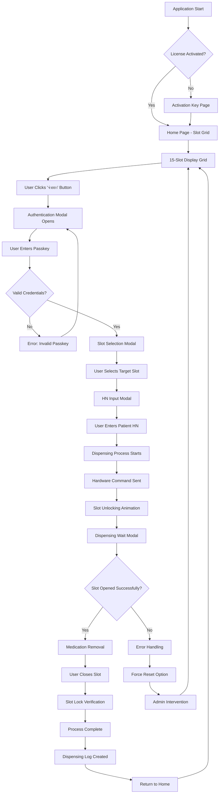
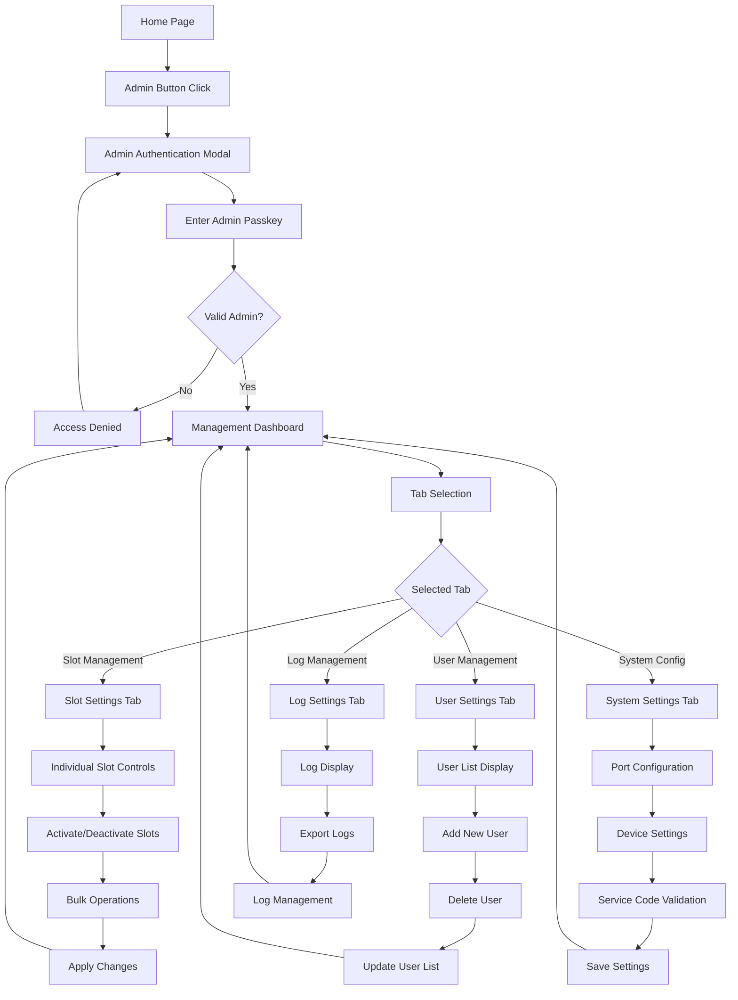
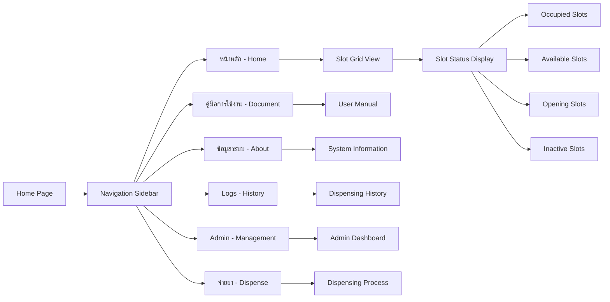

# Product Requirements Document (PRD)
## Smart Medication Cart (SMC) Version 1.0

### Executive Summary
Smart Medication Cart (SMC) is an Electron-based desktop application designed for automated medication dispensing and management in healthcare environments. The system provides secure medication storage, controlled access, comprehensive logging, and real-time monitoring capabilities.

### Product Overview

#### Product Name
Smart Medication Cart (SMC) V1.0

#### Version
1.0.0

#### Target Platform
- Desktop Application (Electron)
- Operating Systems: Windows, Linux
- Architecture: ARM64, ARMv7l, x64

#### Tech Stack
- **Frontend**: Next.js, React 18, TypeScript
- **Backend**: Electron Main Process, Node.js
- **Database**: SQLite with Sequelize ORM
- **Hardware Interface**: Serial Communication (SerialPort)
- **UI Framework**: TailwindCSS, DaisyUI
- **State Management**: React Context API

### Product Purpose
The SMC system is designed to:
1. Provide secure, automated medication dispensing
2. Track and log all medication access activities
3. Manage user authentication and authorization
4. Monitor hardware status and connectivity
5. Ensure regulatory compliance and audit trails

### Core Features

#### 1. Authentication & Authorization
- **Multi-role User System**: Support for regular users and administrators
- **Passkey Authentication**: Secure login using individual passkeys
- **Admin Controls**: Administrative functions require elevated privileges
- **Session Management**: Automatic logout and session timeouts

#### 2. Medication Dispensing System
- **15-Slot Medication Storage**: Physical storage compartments numbered 1-15
- **Secure Access Control**: Individual slot locking/unlocking mechanisms
- **Patient Association**: Each dispensing linked to patient HN (Hospital Number)
- **Real-time Status**: Live monitoring of slot occupancy and availability

#### 3. Hardware Integration
- **KU16 Device Interface**: Primary controller for medication compartments
- **Serial Communication**: RS-232/USB communication protocols
- **Indicator Device**: Visual/audio feedback system
- **Port Management**: Configurable serial port settings

#### 4. Comprehensive Logging
- **Dispensing Logs**: Complete audit trail of all medication access
- **System Logs**: Application events and system activities
- **User Activity Tracking**: Detailed user action logging
- **Export Functionality**: Log export for compliance and reporting

#### 5. System Management
- **Slot Configuration**: Enable/disable individual medication compartments
- **User Management**: Add, remove, and modify user accounts
- **System Settings**: Port configuration, baudrate settings, service codes
- **Hardware Monitoring**: Real-time device status and connectivity

#### 6. License Management
- **Activation Key System**: Software licensing and activation
- **Customer Information**: Organization and customer data management
- **Service Code Validation**: Secure configuration access

### Database Schema

#### User Table
```sql
- id (INTEGER, PRIMARY KEY, AUTO_INCREMENT)
- name (STRING) - User display name
- role (STRING) - User role (admin/user)
- passkey (TEXT) - Encrypted authentication key
```

#### Slot Table
```sql
- slotId (INTEGER, PRIMARY KEY) - Slot number (1-15)
- hn (TEXT) - Hospital Number/Patient ID
- timestamp (INTEGER) - Last activity timestamp
- occupied (BOOLEAN) - Slot occupancy status
- opening (BOOLEAN) - Slot opening state
- isActive (BOOLEAN) - Slot availability status
```

#### Setting Table
```sql
- id (INTEGER, PRIMARY KEY, AUTO_INCREMENT)
- ku_port (STRING) - KU16 device serial port
- ku_baudrate (INTEGER) - Communication speed
- available_slots (INTEGER) - Number of active slots
- max_user (INTEGER) - Maximum user limit
- service_code (STRING) - Admin access code
- max_log_counts (INTEGER) - Log retention limit
- organization (STRING) - Organization name
- customer_name (STRING) - Customer information
- activated_key (STRING) - License activation key
- indi_port (STRING) - Indicator device port
- indi_baudrate (INTEGER) - Indicator baudrate
```

#### DispensingLog Table
```sql
- id (INTEGER, PRIMARY KEY, AUTO_INCREMENT)
- timestamp (INTEGER) - Activity timestamp
- userId (INTEGER, FOREIGN KEY) - User performing action
- slotId (INTEGER) - Affected slot number
- hn (TEXT) - Patient Hospital Number
- process (TEXT) - Type of operation
- message (TEXT) - Detailed activity description
- createdAt (TIMESTAMP) - Record creation time
```

#### Log Table
```sql
- id (INTEGER, PRIMARY KEY, AUTO_INCREMENT)
- user (STRING) - User identifier
- message (TEXT) - Log message content
- createdAt (TIMESTAMP) - Log entry timestamp
```

### User Journey Flow

#### Primary User Journey (Medication Dispensing)



#### Administrative Journey



#### System Navigation Flow



### Page Architecture

#### 1. Application Root (`_app.tsx`)
- **Purpose**: Application wrapper with global providers
- **Context Providers**: 
  - ErrorProvider
  - AppProvider  
  - DispensingProvider
- **Global Styles**: TailwindCSS globals
- **Database Connection**: None (Client-side only)

#### 2. Home Page (`home.tsx`)
- **Purpose**: Main dashboard showing slot grid and status
- **Key Features**:
  - 15-slot medication compartment grid (3x5 layout)
  - Real-time slot status (occupied, active, opening)
  - Dispensing controls and modals
  - Navigation sidebar
- **Database Connections**:
  - Reads from Slot table for real-time status
  - Triggers DispensingLog entries on actions
- **IPC Channels**: 
  - Slot status updates
  - Hardware communication
  - User authentication

#### 3. Activation Key Page (`activate-key.tsx`)
- **Purpose**: Software license activation
- **Key Features**:
  - Activation key input form
  - License validation
  - System initialization
- **Database Connections**:
  - Updates Setting table with activated_key
- **IPC Channels**:
  - `activate-key`
  - `check-activation-key`

#### 4. Settings Page (`setting.tsx`)
- **Purpose**: System configuration and port settings
- **Key Features**:
  - Serial port configuration
  - Baudrate settings
  - Service code validation
  - Hardware status indicators
- **Database Connections**:
  - Reads/Updates Setting table
- **IPC Channels**:
  - `set-setting-res`
  - `init`

#### 5. Logs Page (`logs.tsx`)
- **Purpose**: Display medication dispensing history
- **Key Features**:
  - Chronological log display
  - Date/time formatting
  - User activity tracking
- **Database Connections**:
  - Reads from DispensingLog table
  - Joins with User table for user details
- **IPC Channels**:
  - `get_dispensing_logs`

#### 6. Management Page (`management/index.tsx`)
- **Purpose**: Administrative dashboard with tabbed interface
- **Key Features**:
  - **Slot Management Tab**:
    - Individual slot activation/deactivation
    - Bulk slot operations
    - Slot status monitoring
  - **User Management Tab**:
    - Add/remove users
    - User role assignment
    - Passkey management
  - **System Settings Tab**:
    - Port selection and configuration
    - Hardware device management
    - Service code updates
  - **Log Management Tab**:
    - Log viewing and filtering
    - Export functionality
    - Log retention settings
- **Database Connections**:
  - All tables (comprehensive admin access)
  - Slot table: slot management
  - User table: user administration
  - Setting table: system configuration
  - DispensingLog/Log tables: audit access
- **IPC Channels**:
  - `get-port-list`
  - `get-user`
  - `get-all-slots`
  - `get_dispensing_logs`
  - `export_logs`
  - `deactivate-all`
  - `reactivate-all`
  - `deactivate-admin`
  - `reactivate-admin`
  - `delete-user`
  - `set-selected-port`
  - `set-indicator-port`

#### 7. About Page (`about.tsx`)
- **Purpose**: System information and version details
- **Key Features**:
  - Application version
  - Company information
  - System specifications
- **Database Connections**: None
- **IPC Channels**: None

#### 8. Document Page (`document.tsx`)
- **Purpose**: User manual and documentation
- **Key Features**:
  - Usage instructions
  - Troubleshooting guides
  - System documentation
- **Database Connections**: None
- **IPC Channels**: None

#### 9. Error Page (`error/index.tsx`)
- **Purpose**: Error handling and display
- **Key Features**:
  - Error message display
  - Recovery options
  - System diagnostics
- **Database Connections**: None
- **IPC Channels**: Error reporting

### Hardware Interface

#### KU16 Device Communication
- **Protocol**: Serial RS-232/USB
- **Commands**: Custom protocol for slot control
- **Functions**:
  - Slot locking/unlocking
  - Status monitoring
  - Hardware diagnostics
  - Force reset capabilities

#### Indicator Device
- **Purpose**: Visual/audio feedback
- **Features**:
  - LED status indicators
  - Audio alerts
  - Connection monitoring

### Security Features

#### Access Control
- **User Authentication**: Individual passkey system
- **Role-based Permissions**: Admin vs. regular user privileges
- **Session Management**: Automatic timeouts and security

#### Audit Trail
- **Complete Logging**: All user actions tracked
- **Immutable Records**: Tamper-evident log entries
- **Export Capabilities**: Compliance reporting

#### Hardware Security
- **Physical Locks**: Electromechanical slot locking
- **Communication Encryption**: Secure device protocols
- **Access Monitoring**: Real-time security status

### Performance Requirements

#### Response Time
- **Slot Operations**: < 2 seconds
- **UI Navigation**: < 500ms
- **Database Queries**: < 1 second
- **Hardware Communication**: < 3 seconds

#### Reliability
- **System Uptime**: 99.9% availability
- **Data Integrity**: ACID compliance
- **Error Recovery**: Automatic retry mechanisms
- **Backup Systems**: Data redundancy

#### Scalability
- **Concurrent Users**: Up to 50 simultaneous sessions
- **Log Storage**: 1M+ entries with performance
- **Database Size**: 100MB+ with optimization

### Compliance & Regulations

#### Healthcare Standards
- **Data Privacy**: PHI protection requirements
- **Audit Trails**: Regulatory compliance logging
- **Access Controls**: Healthcare security standards

#### Software Licensing
- **Activation System**: License key validation
- **Usage Tracking**: Compliance monitoring
- **Customer Management**: Organization tracking

### Technical Architecture

#### Frontend (Renderer Process)
- **Framework**: Next.js with React 18
- **State Management**: Context API with custom hooks
- **Styling**: TailwindCSS + DaisyUI
- **Communication**: IPC with main process

#### Backend (Main Process)
- **Runtime**: Node.js with Electron
- **Database**: SQLite with Sequelize ORM
- **Hardware**: SerialPort communication
- **Authentication**: Custom passkey system

#### Data Flow
1. **User Interface** → Context/Hooks → IPC Renderer
2. **IPC Main** → Business Logic → Database/Hardware
3. **Hardware Events** → IPC → State Updates → UI Refresh

### Development & Deployment

#### Build System
- **Development**: Nextron development server
- **Production**: Electron Builder
- **Targets**: Windows x64, Linux ARM64/ARMv7l

#### Distribution
- **Package Format**: AppImage (Linux), NSIS (Windows)
- **Resources**: Embedded SQLite database
- **Installation**: Desktop application installer

### Quality Assurance

#### Testing Strategy
- **Unit Tests**: Component and function testing
- **Integration Tests**: IPC and database testing
- **Hardware Tests**: Device communication validation
- **User Acceptance**: End-to-end workflow testing

#### Error Handling
- **Graceful Degradation**: Fallback mechanisms
- **User Feedback**: Clear error messages
- **Recovery Procedures**: Automated error recovery
- **Logging**: Comprehensive error tracking

### Future Enhancements

#### Planned Features
- **Network Connectivity**: Remote monitoring capabilities
- **Mobile App**: Companion mobile application
- **Advanced Analytics**: Usage pattern analysis
- **Multi-language**: Internationalization support

#### Scalability Considerations
- **Database Migration**: PostgreSQL/MySQL support
- **Cloud Integration**: Remote backup and sync
- **Multi-site**: Distributed deployment support
- **API Development**: REST API for integrations

### Conclusion

The Smart Medication Cart (SMC) V1.0 provides a comprehensive solution for automated medication dispensing with robust security, complete audit trails, and healthcare compliance features. The system architecture supports reliable operation in demanding healthcare environments while maintaining ease of use and administrative control.