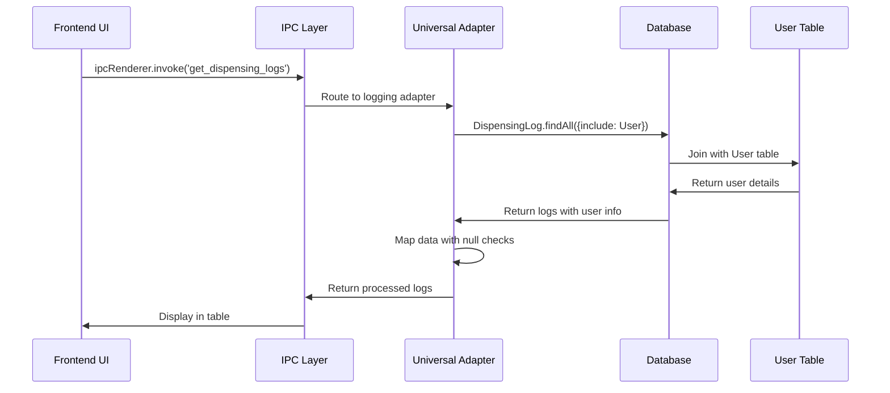
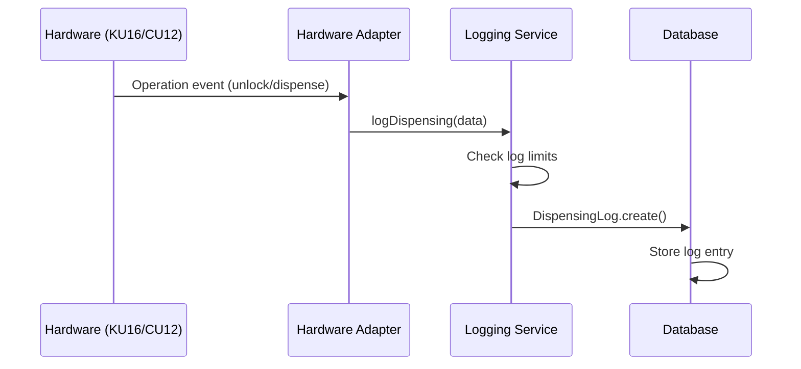
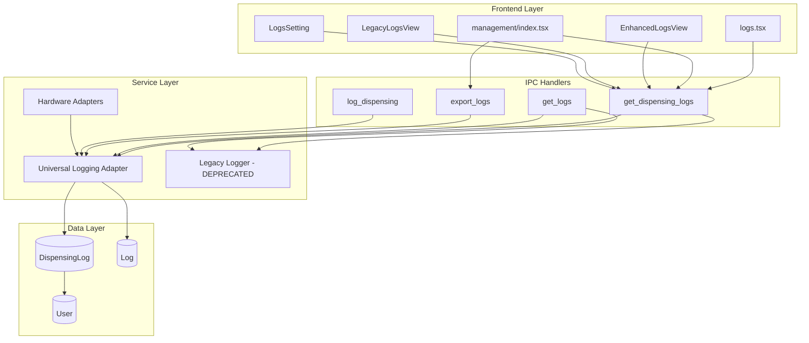

# Logging System Architecture Analysis

## Overview
This document provides a comprehensive analysis of the Smart Medication Cart's logging system architecture, identifying current implementation, data flows, and areas for improvement.

## Current Architecture

### Frontend Components

#### 1. Primary Log Views
```
renderer/pages/logs.tsx                    - Basic log display (legacy)
renderer/pages/management/index.tsx        - Admin management with export
renderer/components/Logs/EnhancedLogsView.tsx - Advanced features
renderer/components/Logs/LegacyLogsView.tsx   - Fallback compatibility
```

#### 2. Supporting Components
```
renderer/components/Settings/LogsSetting.tsx  - Admin log settings
renderer/components/Logs/LogFilterPanel.tsx   - Advanced filtering
renderer/components/Logs/EnhancedLogTable.tsx - Enhanced table display
```

### Backend Services

#### 1. Universal Adapters (Current Standard)
```typescript
// File: main/adapters/loggingAdapter.ts
export const registerUniversalLoggingHandlers = () => {
  // get_dispensing_logs - Primary log retrieval
  // get_logs - System logs
  // export_logs - JSON export functionality
  // log_dispensing - New log creation
}
```

#### 2. Legacy Handlers (Deprecated)
```typescript
// File: main/logger/index.ts
export const logDispensingHanlder = (ku16: KU16) => {
  // Legacy handler - should be removed
}
```

### Database Models

#### 1. DispensingLog Model (Primary)
```typescript
// Fields: id, timestamp, userId, slotId, hn, process, message
// Relations: belongsTo(User, { foreignKey: "userId" })
// Purpose: Medical dispensing operations and hardware events
```

#### 2. Log Model (Secondary/Legacy)
```typescript
// Fields: id, user (STRING), message, createdAt
// Purpose: General system events (no user relationship)
```

## Data Flow Analysis

### 1. Frontend → Backend Flow


### 2. Hardware → Database Flow


## Current Issues & Problems

### 1. Architecture Issues
- **Dual Model System**: Both `DispensingLog` and `Log` models exist
- **Handler Duplication**: Legacy and universal handlers do the same thing
- **Inconsistent Types**: User fields stored differently in each model

### 2. UI/UX Issues
- **Missing User Names**: Null user handling not implemented
- **Export Format Mismatch**: UI says CSV, backend exports JSON
- **Poor Error Handling**: No user feedback on failures

### 3. Performance Issues
- **No Pagination**: Loading all logs at once
- **No Caching**: Every request hits database
- **No Real-time Updates**: Manual refresh required

## Component Interaction Map



## Technology Stack

### Frontend
- **React**: Component-based UI
- **Next.js**: Page routing and SSR
- **Electron IPC**: Main/renderer communication
- **TypeScript**: Type safety

### Backend
- **Electron Main Process**: Node.js runtime
- **Sequelize ORM**: Database abstraction
- **SQLite**: Local database storage
- **IPC Main Handlers**: Cross-process communication

### Hardware Integration
- **Serial Communication**: Direct hardware control
- **Universal Adapters**: Hardware-agnostic operations
- **State Management**: CU12/KU16 specific logic

## Performance Characteristics

### Current Performance
- **Log Retrieval**: ~100-500ms for 1000+ records
- **Export Operations**: ~2-5s for full dataset
- **Real-time Updates**: Manual refresh only
- **Memory Usage**: Loads all logs into memory

### Bottlenecks
1. **Database Queries**: No indexes on frequently queried fields
2. **Data Transfer**: IPC overhead for large datasets
3. **UI Rendering**: No virtualization for large tables
4. **Export Process**: Synchronous file operations

## Security Considerations

### Current Security
- **User Authentication**: Required for access
- **Admin Permissions**: Export functionality restricted
- **Data Integrity**: Foreign key constraints
- **Audit Trail**: All operations logged

### Security Gaps
- **No Data Encryption**: Logs stored in plain text
- **No Access Logging**: Who accessed what when
- **No Data Retention**: Logs kept indefinitely
- **No Backup Strategy**: Single point of failure

## Recommendations

### Immediate (Phase 1)
1. Fix UI null user display
2. Standardize export format
3. Add basic error handling
4. Remove duplicate handlers

### Short-term (Phase 2)
1. Unify logging models
2. Add pagination
3. Implement caching
4. Add real-time updates

### Long-term (Phase 3)
1. Add data encryption
2. Implement retention policies
3. Add advanced analytics
4. Create backup strategy

## Migration Strategy

### Step 1: Cleanup
- Remove legacy handlers
- Fix immediate bugs
- Update documentation

### Step 2: Consolidation
- Merge logging models
- Standardize interfaces
- Optimize queries

### Step 3: Enhancement
- Add new features
- Improve performance
- Enhance security

This architecture analysis provides the foundation for systematic improvement of the logging system while maintaining medical device compliance and operational reliability.