# CU12 IPC Flows - Complete Documentation

**Hardware**: CU12 (Modern 12-slot Medication Cabinet)  
**Purpose**: Detailed IPC flow documentation for Claude Code understanding  
**Status**: Production system with Universal Adapter compatibility

## CU12 Hardware Overview

CU12 is the modern Smart Medication Cabinet hardware with advanced features:
- **Slots**: 12 medication slots (fixed)
- **Communication**: Packet-based serial protocol with checksums
- **State Management**: 3-mode adaptive monitoring system (idle/active/operation)
- **Protocol**: Custom packet structure with STX/ETX framing
- **Monitoring**: Intelligent resource optimization with circuit breaker pattern
- **Baud Rate**: 19200 with robust error handling

## CU12 State Manager Architecture

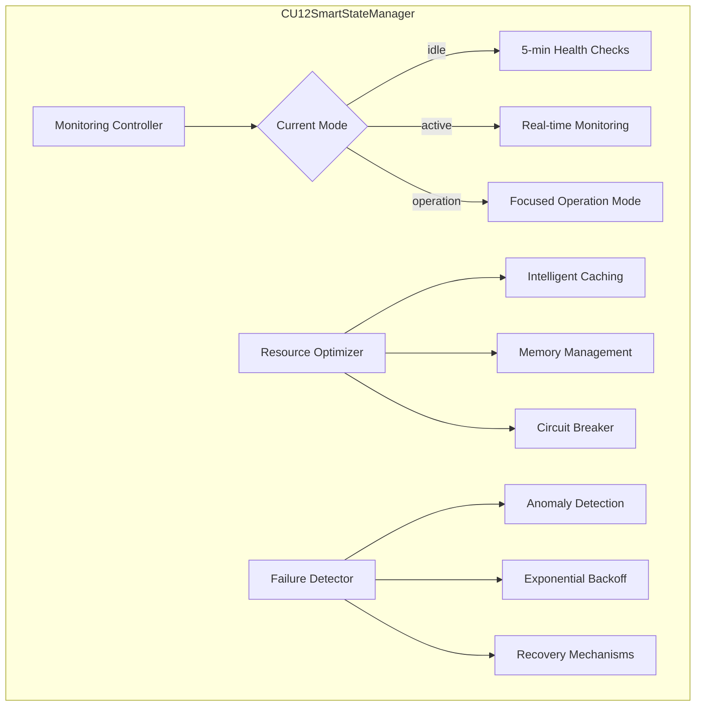

### Adaptive Monitoring Modes

#### Mode Transitions
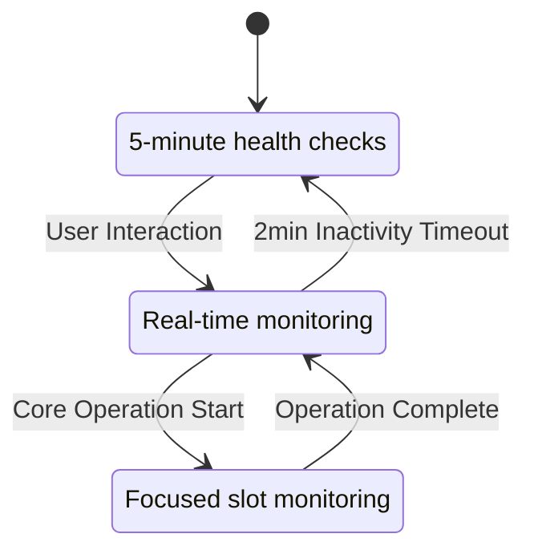

## Complete CU12 IPC Handler Map

### Core Operations (Universal Adapters)

#### 1. System Initialization - `init` → `cu12-init`
**File**: `main/hardware/cu12/ipcMain/init.ts:10`
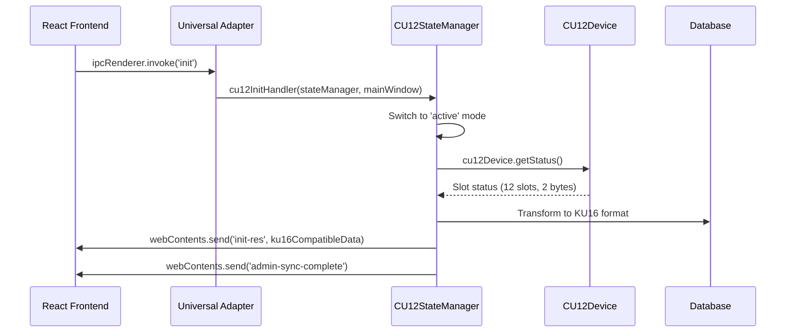

**Parameters**: Any  
**Returns**: `{success: boolean, connected?: boolean, monitoringMode?: string, slotStatus?: SlotStatus[], error?: string}`  
**Hardware Operation**: Triggers user interaction monitoring and status sync

#### 2. Slot Unlock - `unlock` → `cu12-unlock`
**File**: `main/hardware/cu12/ipcMain/unlock.ts:14`
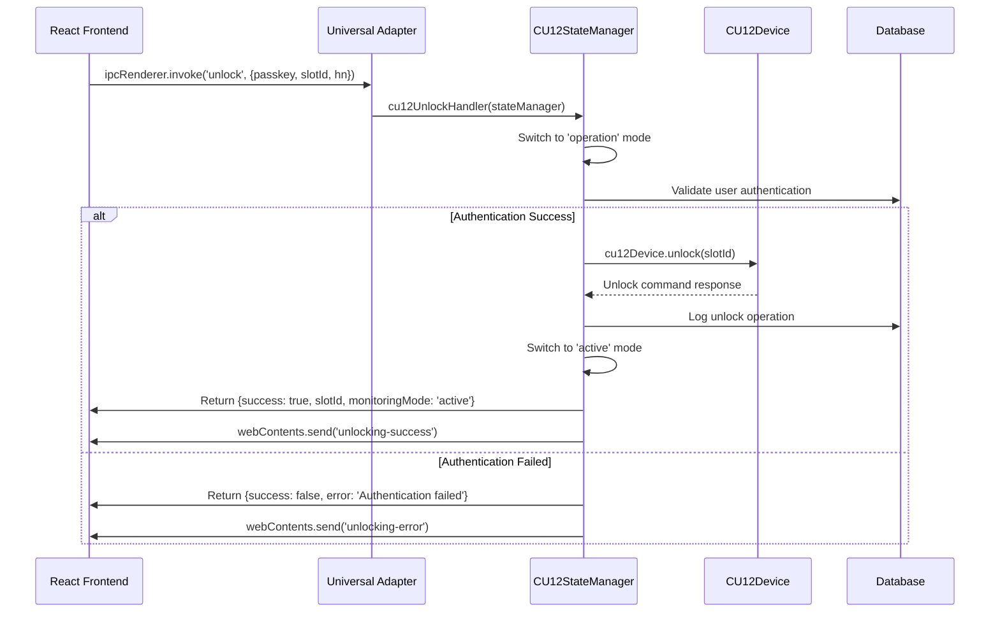

**Parameters**: `{passkey: string, slotId: number, hn?: string}`  
**Returns**: `{success: boolean, slotId: number, monitoringMode?: string, error?: string}`  
**Hardware Operation**: CU12 protocol unlock command with operation mode management

#### 3. Medication Dispensing - `dispense` → `cu12-dispense`
**File**: `main/hardware/cu12/ipcMain/dispensing.ts:14`
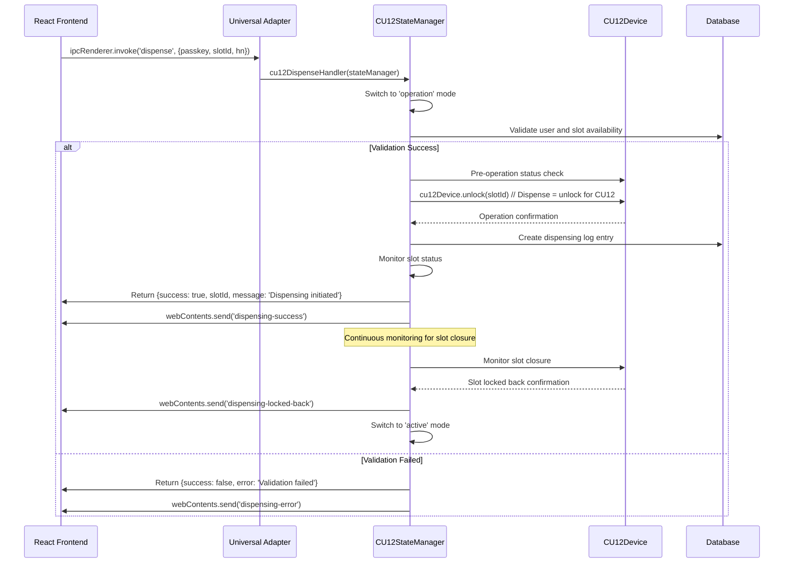

**Parameters**: `{passkey: string, slotId: number, hn?: string}`  
**Returns**: `{success: boolean, slotId: number, message?: string, monitoringMode?: string, error?: string}`  
**Hardware Operation**: Dispense operation with pre/post status checks and continuous monitoring

#### 4. Continue Dispensing - `dispense-continue` → `cu12-dispense-continue`
**File**: `main/hardware/cu12/ipcMain/dispensing-continue.ts:11`
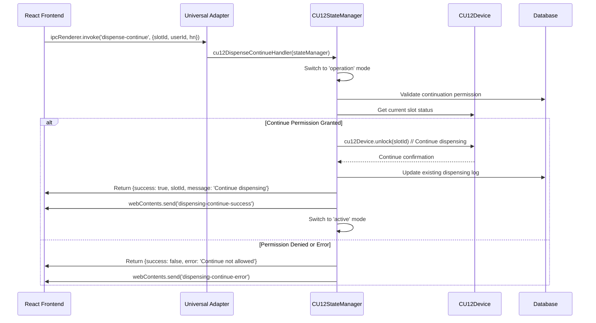

**Parameters**: `{slotId: number, userId?: number, hn?: string}`  
**Returns**: `{success: boolean, slotId: number, message?: string, slotStatus?: SlotStatus, monitoringMode?: string, error?: string}`  
**Hardware Operation**: Continues dispensing process with state validation

#### 5. Slot Reset - `reset` → `cu12-reset`
**File**: `main/hardware/cu12/ipcMain/reset.ts:14`
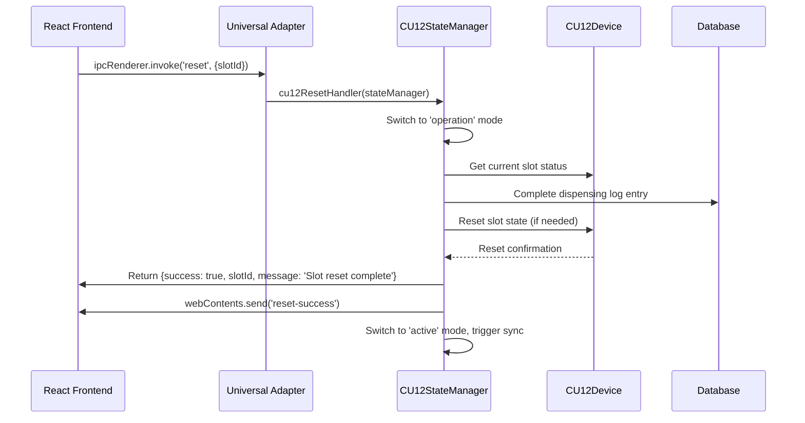

**Parameters**: `{slotId: number}`  
**Returns**: `{success: boolean, slotId: number, message?: string, slotStatus?: SlotStatus, monitoringMode?: string, error?: string}`  
**Hardware Operation**: Completes dispensing process and resets slot state

#### 6. Force Reset - `force-reset` → `cu12-force-reset`
**File**: `main/hardware/cu12/ipcMain/forceReset.ts:12`
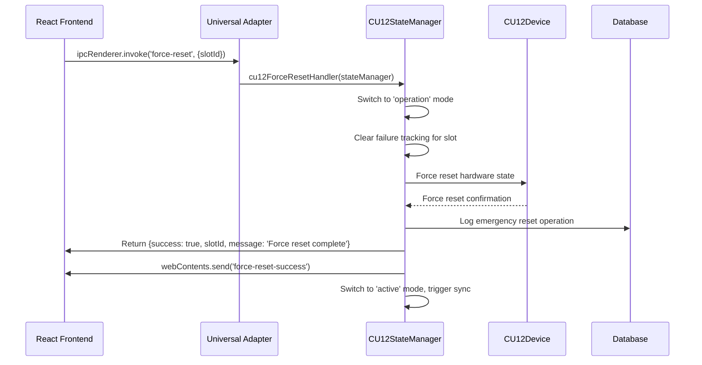

**Parameters**: `{slotId: number}`  
**Returns**: `{success: boolean, slotId: number, message?: string, slotStatus?: SlotStatus, monitoringMode?: string, error?: string}`  
**Hardware Operation**: Emergency reset bypassing normal checks, clears failure tracking

#### 7. Lock Status Check - `check-locked-back` → `cu12-check-locked-back`
**File**: `main/hardware/cu12/ipcMain/status.ts:46`
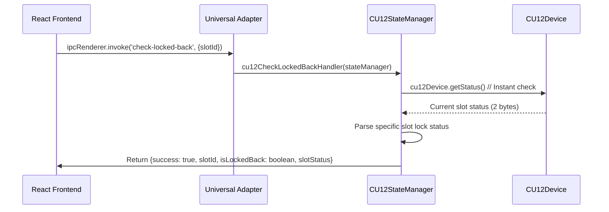

**Parameters**: `{slotId: number}`  
**Returns**: `{success: boolean, slotId: number, isLockedBack?: boolean, slotStatus?: SlotStatus, monitoringMode?: string, error?: string}`  
**Hardware Operation**: Instant lock status check for user-controlled flow

### Status and Monitoring Operations

#### 8. System Status - `cu12-get-status`
**File**: `main/hardware/cu12/ipcMain/status.ts:11`
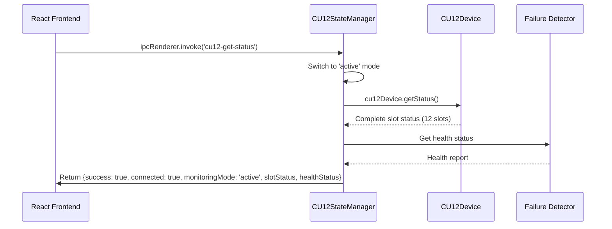

**Parameters**: Any  
**Returns**: `{success: boolean, connected: boolean, monitoringMode: string, slotStatus?: SlotStatus[], healthStatus?: object, timestamp?: number, error?: string}`  
**Hardware Operation**: Triggers active monitoring and provides comprehensive status

#### 9. Health Check - `cu12-health-check`
**File**: `main/hardware/cu12/ipcMain/status.ts:23`
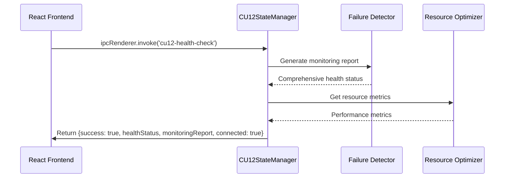

**Parameters**: Any  
**Returns**: `{success: boolean, healthStatus?: object, monitoringReport?: object, connected: boolean, monitoringMode?: string, timestamp?: number, error?: string}`  
**Hardware Operation**: Comprehensive health check with monitoring reports

### Administrative Operations (Universal Adapters)

#### 10. Admin Deactivation - `deactivate-admin` → `cu12-deactivate`
**File**: `main/hardware/cu12/ipcMain/deactivate.ts:11`
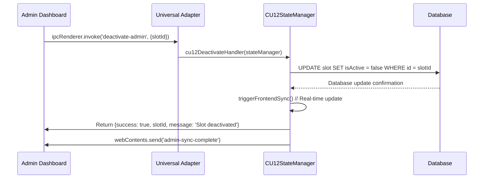

**Parameters**: `{slotId: number}`  
**Returns**: `{success: boolean, slotId: number, message?: string, slotStatus?: SlotStatus, monitoringMode?: string, error?: string}`  
**Database Operation**: Updates slot active status with immediate frontend sync

#### 11. Bulk Deactivation - `deactivate-all` → `cu12-deactivate-all`
**File**: `main/hardware/cu12/ipcMain/deactivate.ts:32`


**Parameters**: Any  
**Returns**: `{success: boolean, message?: string, slotStatuses?: SlotStatus[], monitoringMode?: string, error?: string}`  
**Database Operation**: Bulk deactivation with comprehensive frontend sync

#### 12. Admin Reactivation - `reactivate-admin` → `cu12-reactivate-admin`
**File**: `main/hardware/cu12/ipcMain/reactivate.ts:14`
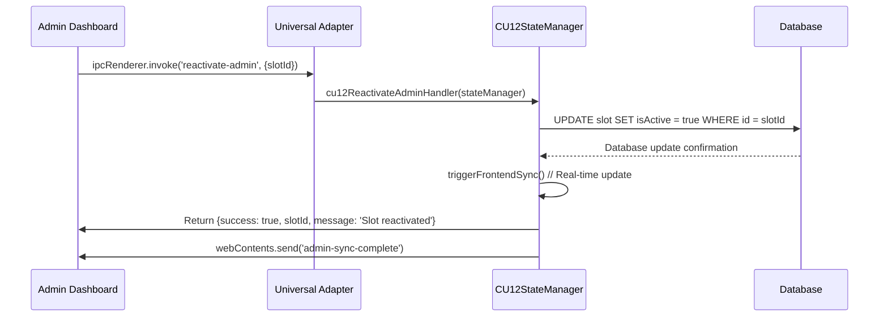

**Parameters**: `{slotId: number}`  
**Returns**: `{success: boolean, slotId: number, message?: string, slotStatus?: SlotStatus, monitoringMode?: string, error?: string}`  
**Database Operation**: Reactivates specific slot with immediate sync

#### 13. Bulk Reactivation - `reactivate-all` → `cu12-reactivate-all`
**File**: `main/hardware/cu12/ipcMain/reactivate.ts:32`
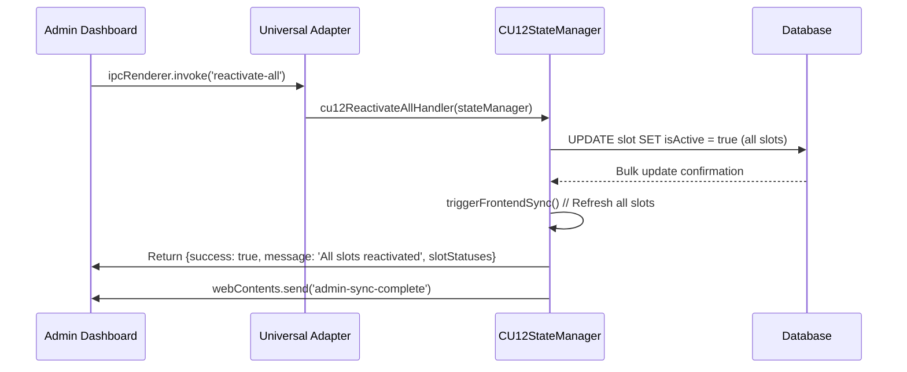

**Parameters**: Any  
**Returns**: `{success: boolean, message?: string, slotStatuses?: SlotStatus[], monitoringMode?: string, error?: string}`  
**Database Operation**: Bulk reactivation with comprehensive frontend sync

## CU12 Hardware Protocol

### Packet Structure
**File**: `main/hardware/cu12/protocol.ts:45-65`

CU12 uses a sophisticated packet-based protocol:
```
STX(1) + ADDR(1) + LOCKNUM(1) + CMD(1) + ASK(1) + DATALEN(1) + ETX(1) + CHECKSUM(1) + DATA(n)
```

### Protocol Commands
```typescript
// Command definitions
GET_STATUS = 0x80    // Request all slot status
UNLOCK = 0x81        // Unlock specific slot
// Additional configuration commands...

// Response codes
SUCCESS = 0x10       // Operation successful
FAILED = 0x11        // Operation failed
TIMEOUT = 0x12       // Communication timeout
```

### Slot Status Format
CU12 represents 12 slots in 2 bytes (16 bits):
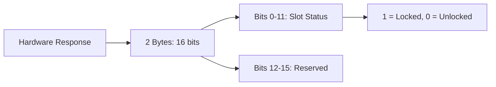

### Checksum Calculation
```typescript
// Checksum = sum of all bytes (low byte only)
const checksum = packet.reduce((sum, byte) => sum + byte, 0) & 0xFF;
```

## CU12 Adaptive Monitoring System

### Resource Optimization Features

#### Intelligent Caching
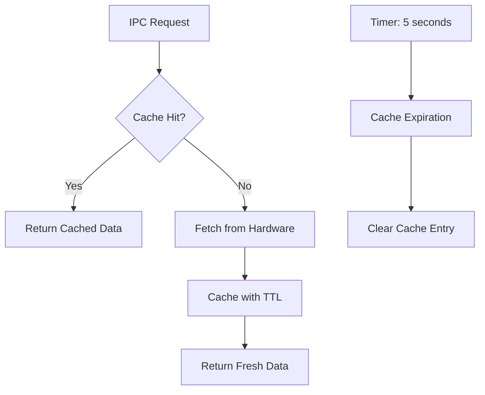

**Default TTL**: 5 seconds  
**Cache Keys**: `slot_status`, `health_check`, `device_info`

#### Circuit Breaker Pattern
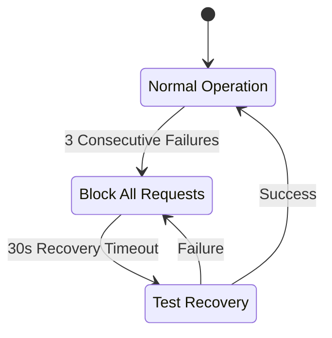

**Failure Threshold**: 3 consecutive failures  
**Recovery Timeout**: 30 seconds  
**Exponential Backoff**: 1s → 2s → 4s → 8s → 16s → 30s (max)

### Failure Detection and Recovery

#### Anomaly Detection Categories
**File**: `main/hardware/cu12/errorHandler.ts:85-120`

1. **Slow Response Detection** (>3s threshold)
2. **State Inconsistency Checks** (hardware vs database)
3. **Resource Usage Monitoring** (memory/CPU)
4. **Communication Error Detection** (circuit breaker status)

#### Health Status Classification
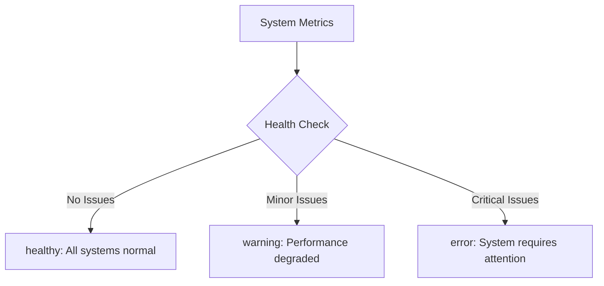

## Real-time Frontend Synchronization

### triggerFrontendSync() Method
**File**: `main/hardware/cu12/stateManager.ts:380-410`

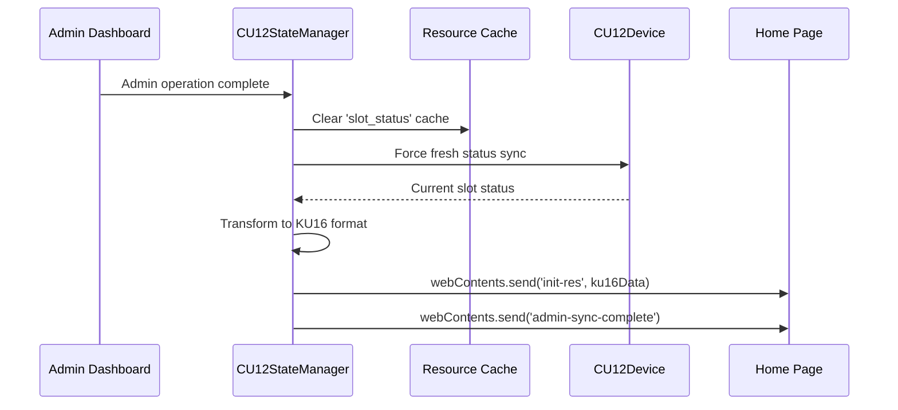

This ensures that admin dashboard changes immediately reflect on the home page.

## Data Transformation Layer

### CU12-to-KU16 Format Adapter
**File**: `main/adapters/cu12DataAdapter.ts`

```mermaid
graph TB
    A[CU12 SlotStatus] --> B[Transform Function]
    B --> C{Hardware Status}
    C --> D[occupied: boolean]
    C --> E[opening: boolean]
    
    B --> F{Database Query}
    F --> G[isActive: boolean]
    F --> H[User Info]
    
    D --> I[KU16 Compatible Object]
    E --> I
    G --> I
    H --> I
```

**Key Transformation**:
- **Hardware status** (occupied, opening) from CU12 device
- **Admin settings** (isActive) from database
- **User information** (hn, timestamp, lastOp) from database
- **Consistent field mapping** for frontend compatibility

## Error Handling and Event Emission

### Standard Event Patterns
All CU12 operations follow consistent event emission:

```typescript
// Success pattern
mainWindow.webContents.send(`${operation}-success`, {
  slotId,
  timestamp: Date.now(),
  monitoringMode: this.currentMode
});

// Error pattern
mainWindow.webContents.send(`${operation}-error`, {
  error: errorMessage,
  slotId,
  timestamp: Date.now()
});
```

### Error Categories

#### Hardware Communication Errors
- Connection timeouts (5-second limit)
- Invalid response packets
- Checksum validation failures
- Serial port communication errors

#### Business Logic Errors
- Authentication failures
- Invalid slot operations
- Database constraint violations
- State inconsistency errors

#### Resource Management Errors  
- Memory allocation failures
- Cache overflow conditions
- Circuit breaker activation
- Resource cleanup failures

## Performance Characteristics

### Resource Usage Optimization
- **Memory Reduction**: Up to 60% reduction in idle mode
- **CPU Usage**: Adaptive based on monitoring mode
- **Network Calls**: Intelligent caching reduces hardware requests
- **Response Time**: <200ms for cached operations, <1s for hardware operations

### Monitoring Mode Performance
| Mode | Health Check Frequency | Resource Usage | Response Time |
|------|----------------------|----------------|---------------|
| idle | 5 minutes | Minimal (10% baseline) | 2-5 seconds |
| active | Real-time | Normal (100% baseline) | <500ms |
| operation | Focused | High (120% baseline) | <200ms |

### Communication Statistics
- **Baud Rate**: 19200 with error recovery
- **Packet Size**: Variable (8-64 bytes typical)
- **Success Rate**: >99% with circuit breaker protection
- **Recovery Time**: <30 seconds after failure

## Integration with Universal Adapters

### Universal Adapter Routing
**File**: `main/adapters/{operation}Adapter.ts`

```typescript
export const registerUniversalXxxHandler = (
  ku16Instance: KU16 | null,
  cu12StateManager: CU12SmartStateManager | null,
  mainWindow: BrowserWindow
) => {
  ipcMain.handle('standard-name', async (event, payload) => {
    const hardwareInfo = await getHardwareType();
    
    if (hardwareInfo.type === 'CU12' && cu12StateManager) {
      // Route to CU12 implementation
      return await cu12StateManager.performOperation(payload);
    } else if (hardwareInfo.type === 'KU16' && ku16Instance) {
      // Route to KU16 implementation  
      return await ku16Instance.operation(payload);
    }
    
    throw new Error('No compatible hardware detected');
  });
};
```

### Hardware Detection Flow
```mermaid
sequenceDiagram
    participant Frontend as React Frontend
    participant Adapter as Universal Adapter
    participant DB as Database Settings
    participant CU12 as CU12StateManager
    
    Frontend->>Adapter: ipcRenderer.invoke('unlock', payload)
    Adapter->>DB: getHardwareType()
    DB-->>Adapter: {type: 'CU12', configured: true}
    Adapter->>CU12: cu12StateManager.performUnlockOperation(payload)
    CU12-->>Adapter: Operation result
    Adapter-->>Frontend: Standardized response
```

## Testing and Validation

### CU12-Specific Test Scenarios
1. **Adaptive Monitoring**: Mode transitions under various load conditions
2. **Circuit Breaker**: Failure recovery and exponential backoff
3. **Real-time Sync**: Admin dashboard to home page updates
4. **Resource Optimization**: Memory and CPU usage in different modes
5. **Protocol Handling**: Packet validation and checksum verification

### Integration Test Points
- Universal adapter routing works correctly
- Event emission maintains KU16 compatibility
- Data transformation preserves frontend functionality
- Error handling provides consistent user experience

---

**CU12 Status**: ✅ **Production Ready via Universal Adapters**  
**Monitoring System**: 3-mode adaptive with resource optimization  
**Protocol**: Packet-based with robust error handling and recovery  
**Frontend Compatibility**: 100% maintained through data transformation layer  
**Performance**: Up to 60% resource reduction in idle mode