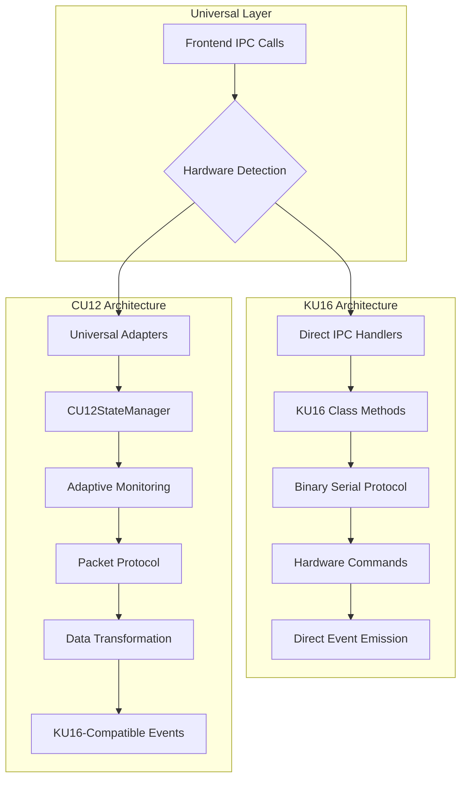

# Debug Guide: KU16 vs CU12 IPC Flow Differences

**Purpose**: Comprehensive debugging guide for Claude Code understanding  
**Focus**: Key differences, missing flows, and troubleshooting between hardware types  
**Status**: Production debugging reference

## Executive Summary

This document identifies critical differences between KU16 (original) and CU12 (modern) hardware systems that can cause debugging challenges. Understanding these differences is essential for troubleshooting IPC flow issues.

## Architecture Comparison Overview



## Critical Differences Summary

| Aspect | KU16 (Original) | CU12 (Modern) | Debug Impact |
|--------|-----------------|---------------|--------------|
| **Slots** | 15 slots (1-15) | 12 slots (1-12) | Slot ID validation differs |
| **Protocol** | Binary 5-byte commands | Packet-based with checksums | Communication debugging differs |
| **State Management** | Direct flags in class | 3-mode adaptive monitoring | State tracking complexity |
| **IPC Names** | Direct (`unlock`) | Prefixed (`cu12-unlock`) | Handler registration conflicts |
| **Data Flow** | KU16 → Database → Frontend | CU12 → Transform → Database → Frontend | Data transformation layer |
| **Error Handling** | Basic try-catch | Circuit breaker + exponential backoff | Recovery mechanism differences |
| **Real-time Updates** | Limited | Advanced with `triggerFrontendSync()` | Admin sync behavior |
| **Resource Usage** | Continuous monitoring | Adaptive (idle/active/operation) | Performance characteristics |

## IPC Handler Differences

### 1. Handler Registration Conflicts

#### Problem: Duplicate Handler Registration
**Root Cause**: CU12 had prefixed handlers but frontend expected standard names

```typescript
// ❌ PROBLEMATIC: CU12 original approach
ipcMain.handle('cu12-unlock', ...);  // CU12 handler
ipcMain.handle('unlock', ...);       // KU16 handler
// Frontend calls 'unlock' but gets KU16 handler even in CU12 mode

// ✅ SOLUTION: Universal Adapters
registerUniversalUnlockHandler(ku16Instance, cu12StateManager, mainWindow);
// Automatically routes 'unlock' to correct hardware implementation
```

**Debug Symptoms**:
- CU12 operations failing despite correct hardware detection
- Frontend receiving responses from wrong hardware type
- Event emission inconsistencies

### 2. Operation Mode Management

#### KU16: Simple State Flags
```typescript
class KU16 {
  private opening: boolean = false;
  private dispensing: boolean = false;
  private waitForLockedBack: boolean = false;
  
  unlock(slotId: number) {
    this.opening = true;
    // Direct hardware command
    this.waitForLockedBack = true;
  }
}
```

#### CU12: Adaptive State Management
```typescript
class CU12SmartStateManager {
  private currentMode: 'idle' | 'active' | 'operation' = 'idle';
  
  async performUnlockOperation(payload: UnlockPayload) {
    // Switch to operation mode
    this.switchToOperationMode();
    
    try {
      const result = await this.cu12Device.unlock(payload.slotId);
      // Switch back to active mode
      this.switchToActiveMode();
      return result;
    } catch (error) {
      // Handle with circuit breaker
      this.failureDetector.recordFailure(error);
      throw error;
    }
  }
}
```

**Debug Impact**:
- **KU16**: Simple boolean flags for debugging state
- **CU12**: Complex mode transitions require monitoring mode tracking
- **Common Issue**: CU12 operations failing due to incorrect mode assumptions

### 3. Real-time Update Mechanisms

#### KU16: Direct Event Emission
```typescript
// KU16: Simple event emission after operation
ku16.unlock(slotId);
mainWindow.webContents.send('unlocking-success', { slotId });
```

#### CU12: Advanced Synchronization System
```typescript
// CU12: Multi-step synchronization process
async triggerFrontendSync(): Promise<void> {
  // Clear cache to ensure fresh data
  this.resourceOptimizer.cache.delete('slot_status');
  
  // Get current status and transform to KU16 format
  const currentStatus = await this.syncSlotStatus('ON_DEMAND');
  const ku16CompatibleData = await transformCU12ToKU16Format(currentStatus);
  
  // Send multiple events for reliable updates
  this.mainWindow.webContents.send("init-res", ku16CompatibleData);
  this.mainWindow.webContents.send("admin-sync-complete", {
    message: "Admin operation completed - UI updated",
    timestamp: Date.now()
  });
}
```

**Debug Symptoms**:
- **KU16**: Admin operations don't automatically update home page
- **CU12**: Multiple event emissions can cause UI update races
- **Common Issue**: Admin dashboard changes not reflecting in real-time

## Protocol and Communication Differences

### Hardware Communication Protocols

#### KU16: Binary Serial Protocol
```typescript
// Command structure: [STX, Channel, Command, ETX, Checksum]
const statusCommand = [0x02, 0x00, 0x30, 0x03, 0x35];
const unlockChannel1 = [0x02, 0x01, 0x31, 0x03, 0x37];

// Response parsing: Binary to decimal arrays
const parseKU16Response = (binaryData: Buffer): SlotStatus[] => {
  // Direct bit manipulation for 15 slots
  return parseSlotBits(binaryData, 15);
};
```

#### CU12: Packet-Based Protocol
```typescript
// Packet structure: STX + ADDR + LOCKNUM + CMD + ASK + DATALEN + ETX + CHECKSUM + DATA
interface CU12Packet {
  stx: 0x02;           // Start of text
  addr: number;        // Device address
  locknum: number;     // Lock number (1-12)
  cmd: number;         // Command (0x80=status, 0x81=unlock)
  ask: number;         // Ask field
  datalen: number;     // Data length
  etx: 0x03;          // End of text
  checksum: number;    // Sum of all bytes (low byte)
  data?: number[];     // Optional data payload
}

// Response parsing: 12 slots in 2 bytes
const parseCU12Response = (responseBytes: number[]): CU12SlotStatus[] => {
  // Parse 2-byte slot status for 12 slots
  const slotBits = (responseBytes[1] << 8) | responseBytes[0];
  return parseCU12SlotBits(slotBits, 12);
};
```

**Debug Implications**:
- **Packet Validation**: CU12 requires checksum validation; KU16 uses simpler checksums
- **Slot Parsing**: Different bit layouts for slot status
- **Error Detection**: CU12 has more sophisticated error detection

### Communication Debugging Commands

#### KU16 Debug Commands
```bash
# Serial port monitoring
screen /dev/tty.usbserial-ku16 19200

# Status check command (hex)
echo -e "\x02\x00\x30\x03\x35" > /dev/tty.usbserial-ku16
```

#### CU12 Debug Commands
```bash
# CU12 status request packet
echo -e "\x02\x01\x00\x80\x00\x00\x03\x86" > /dev/tty.usbserial-cu12

# CU12 unlock slot 1 packet  
echo -e "\x02\x01\x01\x81\x00\x00\x03\x88" > /dev/tty.usbserial-cu12
```

## Data Transformation Issues

### Slot Status Format Differences

#### KU16 Native Format
```typescript
interface KU16SlotStatus {
  slotId: number;           // 1-15
  hn?: string;             // From database
  timestamp?: number;       // From database
  lastOp?: string;         // From database
  occupied: boolean;        // Direct from hardware
  opening: boolean;         // Direct from hardware
  isActive: boolean;        // From database
}
```

#### CU12 Native Format
```typescript
interface CU12SlotStatus {
  slotId: number;           // 1-12
  isLocked: boolean;        // Hardware: 1=locked, 0=unlocked
  isUnlocking: boolean;     // State manager flag
  hardwareStatus: number;   // Raw hardware bits
}
```

#### CU12-to-KU16 Transformation
```typescript
const transformCU12ToKU16Format = async (cu12Status: CU12SlotStatus[]): Promise<KU16SlotStatus[]> => {
  return Promise.all(cu12Status.map(async (slot) => {
    const dbSlot = await Slot.findByPk(slot.slotId);
    
    return {
      slotId: slot.slotId,
      // CRITICAL: Mapping differences
      occupied: slot.isLocked,          // CU12 locked = KU16 occupied
      opening: slot.isUnlocking,        // CU12 unlocking = KU16 opening
      // Database fields remain the same
      isActive: dbSlot?.isActive ?? true,
      hn: dbSlot?.hn || undefined,
      timestamp: dbSlot?.timestamp || undefined,
      lastOp: dbSlot?.lastOp || undefined
    };
  }));
};
```

**Debug Issues**:
- **Field Mapping**: `isLocked` (CU12) ≠ `occupied` (KU16) semantic differences
- **Slot Count**: Frontend expecting 15 slots but CU12 only has 12
- **State Sync**: Database and hardware state can become inconsistent

## Error Handling and Recovery Differences

### KU16: Basic Error Handling
```typescript
try {
  const result = await ku16.unlock(slotId);
  mainWindow.webContents.send('unlocking-success', { slotId });
} catch (error) {
  console.error('KU16 unlock failed:', error.message);
  mainWindow.webContents.send('unlocking-error', { error: error.message, slotId });
}
```

### CU12: Advanced Error Handling with Circuit Breaker
```typescript
class CU12FailureDetector {
  private circuitBreaker = {
    state: 'closed' as 'closed' | 'open' | 'half-open',
    failureCount: 0,
    lastFailureTime: 0,
    consecutiveFailures: 0
  };
  
  async executeWithCircuitBreaker<T>(operation: () => Promise<T>): Promise<T> {
    // Check circuit breaker state
    if (this.circuitBreaker.state === 'open') {
      const timeSinceLastFailure = Date.now() - this.circuitBreaker.lastFailureTime;
      if (timeSinceLastFailure < this.recoveryTimeout) {
        throw new Error('Circuit breaker is open - operation blocked');
      }
      this.circuitBreaker.state = 'half-open';
    }
    
    try {
      const result = await operation();
      this.onSuccess();
      return result;
    } catch (error) {
      this.onFailure(error);
      throw error;
    }
  }
  
  private onFailure(error: Error): void {
    this.circuitBreaker.consecutiveFailures++;
    this.circuitBreaker.lastFailureTime = Date.now();
    
    if (this.circuitBreaker.consecutiveFailures >= this.failureThreshold) {
      this.circuitBreaker.state = 'open';
      console.error('[CU12] Circuit breaker opened due to consecutive failures');
    }
  }
}
```

**Debug Complexity**:
- **KU16**: Straightforward error logging and user notification
- **CU12**: Multi-layered error handling with circuit breaker states
- **Common Issue**: CU12 operations blocked by circuit breaker after repeated failures

## Missing or Incomplete IPC Flows

### 1. Missing Real-time Admin Updates (KU16)

#### Problem
```typescript
// KU16: Admin operation doesn't update home page
ipcMain.handle('deactivate-admin', async (event, payload) => {
  await updateSlotInDatabase(payload.slotId, { isActive: false });
  // ❌ MISSING: No frontend synchronization
  return { success: true };
});
```

#### Solution in Universal Adapters
```typescript
// Universal adapter provides consistent behavior
export const registerUniversalDeactivateAdminHandler = (...) => {
  ipcMain.handle('deactivate-admin', async (event, payload) => {
    if (hardwareInfo.type === 'CU12' && cu12StateManager) {
      const result = await cu12StateManager.deactivateSlot(payload.slotId);
      // ✅ INCLUDES: triggerFrontendSync() for real-time updates
      await cu12StateManager.triggerFrontendSync();
      return result;
    } else if (hardwareInfo.type === 'KU16' && ku16Instance) {
      const result = await ku16Instance.deactivateAdmin(payload);
      // ✅ ADDED: Manual sync for KU16 compatibility
      ku16Instance.sendCheckState();
      return result;
    }
  });
};
```

### 2. Incomplete Continue Dispensing Flow (CU12)

#### Issue: State Validation
```typescript
// CU12: Missing state validation in continue dispensing
ipcMain.handle('cu12-dispense-continue', async (event, payload) => {
  // ❌ MISSING: Check if slot is actually in dispensing state
  // ❌ MISSING: Validate user permissions for continuation
  
  const result = await cu12StateManager.performUnlockOperation(payload);
  return result;
});
```

#### Complete Implementation
```typescript
ipcMain.handle('cu12-dispense-continue', async (event, payload) => {
  try {
    // ✅ VALIDATE: Check current slot state
    const currentStatus = await cu12StateManager.getSlotStatus(payload.slotId);
    if (!currentStatus.inDispensingMode) {
      throw new Error('Slot is not in dispensing mode');
    }
    
    // ✅ VALIDATE: Check user permissions
    const dispensingLog = await DispensingLog.findOne({
      where: { slotId: payload.slotId, status: 'in_progress' }
    });
    
    if (!dispensingLog) {
      throw new Error('No active dispensing session found');
    }
    
    // ✅ PERFORM: Continue operation with validation
    const result = await cu12StateManager.performUnlockOperation(payload);
    return result;
  } catch (error) {
    return { success: false, error: error.message };
  }
});
```

### 3. Port Conflict Issues During Initialization

#### Problem: Dual Hardware Initialization
```typescript
// ❌ PROBLEMATIC: Both hardware types try to initialize
if (hardwareInfo.type === 'CU12') {
  cu12StateManager = new CU12SmartStateManager(...);
  await cu12StateManager.initialize(); // Uses port
}

// This can still run and cause port conflicts
ku16 = new KU16(settings.ku_port, ...); // Tries same port
```

#### Solution: Exclusive Hardware Mode
```typescript
// ✅ SOLUTION: Single hardware mode initialization
if (hardwareInfo.type === 'CU12' && hardwareInfo.isConfigured) {
  // CU12 Mode - Initialize CU12 only
  cu12StateManager = new CU12SmartStateManager(...);
  cu12Initialized = await cu12StateManager.initialize();
  // ku16 remains null
} else if (hardwareInfo.type === 'KU16' && hardwareInfo.isConfigured) {
  // KU16 Mode - Initialize KU16 only
  ku16 = new KU16(...);
  // cu12StateManager remains null
}
```

## Troubleshooting Common Issues

### Issue 1: "Operation not working after hardware switch"

**Symptoms**: 
- Frontend calls work but hardware doesn't respond
- Getting responses from wrong hardware type

**Debug Steps**:
1. Check hardware detection:
```typescript
const hardwareInfo = await getHardwareType();
console.log('Detected hardware:', hardwareInfo);
```

2. Verify universal adapter routing:
```typescript
// Check if correct hardware instance is available
if (hardwareInfo.type === 'CU12' && !cu12StateManager) {
  console.error('CU12 expected but state manager not initialized');
}
```

3. Check IPC handler registration:
```typescript
// Ensure universal adapters are properly registered
console.log('Universal adapters registered:', 
  ipcMain.listenerCount('unlock'), 
  ipcMain.listenerCount('dispense')
);
```

### Issue 2: "Admin operations not updating home page"

**Symptoms**:
- Admin dashboard changes successful
- Home page doesn't reflect changes until manual refresh

**Debug Steps**:
1. Check for `admin-sync-complete` event:
```typescript
// In renderer process
ipcRenderer.on('admin-sync-complete', (data) => {
  console.log('Admin sync received:', data);
  // Should trigger UI refresh
});
```

2. Verify `triggerFrontendSync()` execution:
```typescript
// In CU12StateManager
async triggerFrontendSync(): Promise<void> {
  console.log('[DEBUG] triggerFrontendSync() called');
  this.resourceOptimizer.cache.delete('slot_status');
  const currentStatus = await this.syncSlotStatus('ON_DEMAND');
  console.log('[DEBUG] Current status:', currentStatus);
  // ... rest of sync process
}
```

### Issue 3: "CU12 operations failing with timeout"

**Symptoms**:
- Operations work intermittently
- Timeout errors in console
- Circuit breaker activation

**Debug Steps**:
1. Check circuit breaker state:
```typescript
const healthStatus = await cu12StateManager.getHealthStatus();
console.log('Circuit breaker state:', healthStatus.circuitBreaker);
```

2. Monitor failure patterns:
```typescript
// Enable detailed logging
cu12StateManager.setLogLevel('DEBUG');
// Check consecutive failure count
console.log('Consecutive failures:', cu12StateManager.getConsecutiveFailures());
```

3. Reset circuit breaker if needed:
```typescript
// Emergency circuit breaker reset
await cu12StateManager.resetCircuitBreaker();
```

### Issue 4: "Slot count mismatch between hardware types"

**Symptoms**:
- Frontend showing wrong number of slots
- Slot ID validation errors
- UI layout issues

**Debug Steps**:
1. Check slot count configuration:
```typescript
const hardwareInfo = await getHardwareType();
console.log('Max slots for hardware:', hardwareInfo.maxSlots);
// KU16: 15 slots, CU12: 12 slots
```

2. Verify slot ID validation:
```typescript
const validateSlotId = (slotId: number, hardwareType: string) => {
  const maxSlots = hardwareType === 'CU12' ? 12 : 15;
  if (slotId < 1 || slotId > maxSlots) {
    throw new Error(`Invalid slot ID ${slotId} for ${hardwareType}`);
  }
};
```

## Performance Debugging

### KU16 Performance Characteristics
- **Memory Usage**: Consistent ~50MB baseline
- **CPU Usage**: Low, spikes during operations
- **Response Time**: 100-200ms per operation
- **Connection**: Persistent serial connection

### CU12 Performance Characteristics
- **Memory Usage**: Variable (20MB idle, 80MB active, 120MB operation)
- **CPU Usage**: Adaptive based on monitoring mode
- **Response Time**: <200ms cached, <1s hardware operations
- **Connection**: Smart connection management with recovery

### Performance Debug Commands
```typescript
// CU12: Get performance metrics
const metrics = await cu12StateManager.getPerformanceMetrics();
console.log('Performance metrics:', {
  memoryUsage: metrics.memoryUsage,
  cpuUsage: metrics.cpuUsage,
  cacheHitRate: metrics.cacheHitRate,
  averageResponseTime: metrics.averageResponseTime
});

// KU16: Basic performance tracking
console.log('KU16 performance:', {
  connectionStatus: ku16.isConnected(),
  lastOperationTime: ku16.getLastOperationTime(),
  totalOperations: ku16.getOperationCount()
});
```

## Migration and Compatibility Issues

### Database Schema Compatibility
Both systems use identical database schemas, but field usage differs:

```sql
-- Slot table fields
CREATE TABLE slot (
  id INTEGER PRIMARY KEY,
  hn VARCHAR(255),          -- Used by both
  timestamp INTEGER,        -- Used by both  
  lastOp VARCHAR(255),      -- Used by both
  isActive BOOLEAN,         -- Used by both (admin control)
  -- Hardware-specific usage:
  -- KU16: All fields populated directly
  -- CU12: isActive from DB, occupied/opening from hardware
);
```

### Frontend Compatibility Layer
The universal adapter system maintains frontend compatibility:

```typescript
// Frontend code works identically for both hardware types
const unlockSlot = async (slotId: number) => {
  try {
    // Same IPC call regardless of hardware
    const result = await ipcRenderer.invoke('unlock', {
      passkey: userPasskey,
      slotId: slotId,
      hn: patientHN
    });
    
    if (result.success) {
      console.log('Unlock successful');
    }
  } catch (error) {
    console.error('Unlock failed:', error);
  }
};
```

## Quick Reference: Debug Checklist

### When Operations Fail:
1. ✅ Check hardware detection: `await getHardwareType()`
2. ✅ Verify correct hardware instance initialized
3. ✅ Confirm universal adapters registered properly
4. ✅ Check IPC handler listener counts
5. ✅ Validate slot ID ranges (1-15 KU16, 1-12 CU12)
6. ✅ Monitor circuit breaker state (CU12 only)
7. ✅ Check for port conflicts during initialization

### When UI Updates Fail:
1. ✅ Verify event listeners registered in frontend
2. ✅ Check for `admin-sync-complete` event emission
3. ✅ Confirm `triggerFrontendSync()` execution (CU12)
4. ✅ Validate data transformation layer
5. ✅ Monitor for event emission race conditions

### When Performance Issues Occur:
1. ✅ Check monitoring mode (CU12: idle/active/operation)
2. ✅ Monitor cache hit rates and TTL
3. ✅ Review circuit breaker activation frequency
4. ✅ Check for memory leaks in long-running sessions
5. ✅ Validate serial communication timeouts

---

**Debug Status**: ✅ **Comprehensive Debug Guide Complete**  
**Coverage**: All major differences and issues documented  
**Troubleshooting**: Step-by-step resolution procedures provided  
**Compatibility**: Cross-hardware debugging strategies included