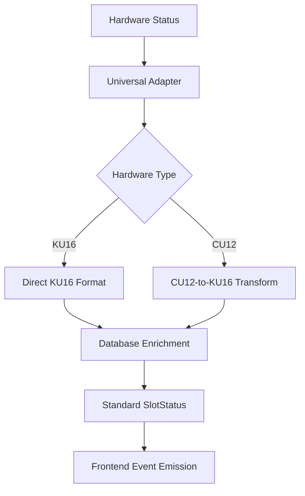

# IPC Conventions and Patterns - Complete Guide

**Purpose**: Standardized IPC patterns for Claude Code understanding  
**Architecture**: Universal Adapter Pattern with Hardware Abstraction  
**Coverage**: All IPC operations across KU16 and CU12 systems

## Universal IPC Naming Conventions

### Standard IPC Call Names (Frontend → Backend)
All frontend code uses these standardized names regardless of hardware type:

| Operation Category | IPC Call Name | Purpose | Universal Adapter |
|-------------------|---------------|---------|-------------------|
| **Core Operations** | | | |
| System Init | `init` | Initialize system and sync slot status | ✅ initAdapter |
| Slot Unlock | `unlock` | Unlock slot for medication loading | ✅ unlockAdapter |
| Medication Dispense | `dispense` | Dispense medication from slot | ✅ dispenseAdapter |
| Continue Dispensing | `dispense-continue` | Continue existing dispensing session | ✅ dispenseAdapter |
| Slot Reset | `reset` | Reset slot after successful dispensing | ✅ resetAdapter |
| Emergency Reset | `force-reset` | Emergency slot reset (bypass checks) | ✅ resetAdapter |
| Status Check | `check-locked-back` | Check if slot is properly closed | ✅ statusAdapter |
| **Admin Operations** | | | |
| Admin Deactivate | `deactivate-admin` | Deactivate single slot (admin only) | ✅ adminAdapters |
| Bulk Deactivate | `deactivate-all` | Deactivate all slots (admin only) | ✅ adminAdapters |
| Admin Reactivate | `reactivate-admin` | Reactivate single slot (admin only) | ✅ adminAdapters |
| Bulk Reactivate | `reactivate-all` | Reactivate all slots (admin only) | ✅ adminAdapters |
| **System Operations** | | | |
| Get Slots | `get-all-slots` | Retrieve all slot configurations | ✅ slotsAdapter |
| Port Discovery | `get-port-list` | List available serial ports | ✅ portListAdapter |
| Settings | `get-setting` | Get system settings | ✅ Direct handler |
| Hardware Config | `set-hardware-type` | Configure hardware type | ✅ Direct handler |

### Hardware-Specific Internal Names
Universal adapters route to these hardware-specific implementations:

| Standard Name | KU16 Internal | CU12 Internal | Notes |
|---------------|---------------|---------------|-------|
| `init` | `init` | `cu12-init` | System initialization |
| `unlock` | `unlock` | `cu12-unlock` | Slot unlock operation |
| `dispense` | `dispense` | `cu12-dispense` | Medication dispensing |
| `dispense-continue` | `dispense-continue` | `cu12-dispense-continue` | Continue dispensing |
| `reset` | `reset` | `cu12-reset` | Slot reset |
| `force-reset` | `force-reset` | `cu12-force-reset` | Emergency reset |
| `check-locked-back` | `check-locked-back` | `cu12-check-locked-back` | Status check |

## IPC Parameter Patterns

### Standard Parameter Structures

#### Authentication Pattern
```typescript
interface AuthenticationPayload {
  passkey: string;        // User authentication key
  slotId: number;         // Target slot (1-15 for KU16, 1-12 for CU12)
  hn?: string;           // Hospital number (optional)
  timestamp?: number;     // Operation timestamp (optional)
}
```

#### Admin Operation Pattern
```typescript
interface AdminPayload {
  name?: string;         // Admin user name (for KU16 legacy)
  slotId?: number;       // Target slot (optional for bulk operations)
}
```

#### Status Check Pattern
```typescript
interface StatusPayload {
  slotId?: number;       // Specific slot to check (optional)
}
```

### Response Patterns

#### Universal Success Response
```typescript
interface SuccessResponse {
  success: true;
  slotId?: number;          // Affected slot ID
  message?: string;         // Success message
  monitoringMode?: string;  // CU12 only: current monitoring mode
  slotStatus?: SlotStatus;  // Updated slot status
  timestamp?: number;       // Operation timestamp
}
```

#### Universal Error Response
```typescript
interface ErrorResponse {
  success: false;
  error: string;           // Error message
  slotId?: number;         // Affected slot ID
  code?: string;           // Error code (optional)
  timestamp?: number;      // Error timestamp
}
```

## Event Emission Patterns

### Standard Frontend Events
All hardware types emit consistent events to maintain frontend compatibility:

#### Core Operation Events
```typescript
// Success events
mainWindow.webContents.send('init-res', slotStatusArray);
mainWindow.webContents.send('unlocking-success', { slotId, timestamp });
mainWindow.webContents.send('dispensing-success', { slotId, timestamp });
mainWindow.webContents.send('dispensing-locked-back', { slotId });
mainWindow.webContents.send('reset-success', { slotId, timestamp });
mainWindow.webContents.send('force-reset-success', { slotId, timestamp });

// Error events
mainWindow.webContents.send('unlocking-error', { error, slotId });
mainWindow.webContents.send('dispensing-error', { error, slotId });
mainWindow.webContents.send('reset-error', { error, slotId });
mainWindow.webContents.send('force-reset-error', { error, slotId });
```

#### Admin Operation Events
```typescript
// CU12-specific: Real-time synchronization
mainWindow.webContents.send('admin-sync-complete', {
  message: 'Admin operation completed - UI updated',
  timestamp: Date.now()
});

// Standard slot update event
mainWindow.webContents.send('cu12-slot-update', { slotId, status });
```

### Event Data Structures

#### Slot Status Format (KU16 Compatible)
```typescript
interface SlotStatus {
  slotId: number;           // Slot identifier (1-based)
  hn?: string | undefined;  // Hospital number
  timestamp?: number;       // Last operation timestamp
  lastOp?: string | undefined; // Last operation performed
  occupied: boolean;        // Hardware: slot has medication
  opening: boolean;         // Hardware: slot is currently opening
  isActive: boolean;        // Database: admin-controlled active state
}
```

This format is used consistently across both KU16 and CU12 systems through data transformation.

## Universal Adapter Pattern Implementation

### Adapter Registration Pattern
```typescript
export const registerUniversalXxxHandler = (
  ku16Instance: KU16 | null,
  cu12StateManager: CU12SmartStateManager | null,
  mainWindow: BrowserWindow
) => {
  ipcMain.handle('standard-ipc-name', async (event, payload) => {
    try {
      // Hardware detection
      const hardwareInfo = await getHardwareType();
      
      // Route to appropriate hardware implementation
      if (hardwareInfo.type === 'CU12' && cu12StateManager) {
        return await cu12StateManager.performOperation(payload);
      } else if (hardwareInfo.type === 'KU16' && ku16Instance) {
        return await ku16Instance.operation(payload);
      }
      
      throw new Error('No compatible hardware detected');
    } catch (error) {
      console.error(`[ADAPTER] ${operation} error:`, error.message);
      return { success: false, error: error.message };
    }
  });
};
```

### Hardware Detection Pattern
```typescript
// Always use this pattern for hardware detection
const hardwareInfo = await getHardwareType();
console.log(`Hardware: ${hardwareInfo.type}, Port: ${hardwareInfo.port}`);

// Hardware info structure
interface HardwareInfo {
  type: 'KU16' | 'CU12';
  port: string | null;
  baudrate: number | null;
  maxSlots: number;
  isConfigured: boolean;
}
```

## Error Handling Conventions

### Standard Error Handling Pattern
```typescript
try {
  // Hardware operation
  const result = await hardwareOperation(payload);
  
  // Success response
  return {
    success: true,
    slotId: payload.slotId,
    message: 'Operation completed successfully',
    ...result
  };
} catch (error) {
  // Log error with context
  console.error(`[${hardwareType}] ${operation} failed:`, error.message);
  
  // Emit error event to frontend
  mainWindow.webContents.send(`${operation}-error`, {
    error: error.message,
    slotId: payload.slotId,
    timestamp: Date.now()
  });
  
  // Return error response
  return {
    success: false,
    error: error.message,
    slotId: payload.slotId
  };
}
```

### Error Categories and Codes

#### Authentication Errors
```typescript
// User validation failures
{ error: 'Invalid passkey', code: 'AUTH_INVALID_PASSKEY' }
{ error: 'User not found', code: 'AUTH_USER_NOT_FOUND' }
{ error: 'Insufficient permissions', code: 'AUTH_INSUFFICIENT_PERMISSIONS' }
```

#### Hardware Errors
```typescript
// Communication failures
{ error: 'Hardware connection timeout', code: 'HW_CONNECTION_TIMEOUT' }
{ error: 'Invalid hardware response', code: 'HW_INVALID_RESPONSE' }
{ error: 'Serial port not available', code: 'HW_PORT_UNAVAILABLE' }
```

#### Business Logic Errors
```typescript
// Operation constraints
{ error: 'Slot already in use', code: 'BL_SLOT_IN_USE' }
{ error: 'Invalid slot ID', code: 'BL_INVALID_SLOT_ID' }
{ error: 'Operation not allowed in current state', code: 'BL_INVALID_STATE' }
```

## Database Interaction Patterns

### Standard Database Operations

#### User Authentication Pattern
```typescript
const authenticateUser = async (passkey: string): Promise<User | null> => {
  try {
    const user = await User.findOne({ where: { passkey } });
    if (!user) {
      throw new Error('Invalid passkey');
    }
    return user;
  } catch (error) {
    throw new Error(`Authentication failed: ${error.message}`);
  }
};
```

#### Slot Status Update Pattern
```typescript
const updateSlotStatus = async (slotId: number, updates: Partial<Slot>): Promise<Slot> => {
  try {
    const [updatedCount] = await Slot.update(updates, {
      where: { id: slotId }
    });
    
    if (updatedCount === 0) {
      throw new Error(`Slot ${slotId} not found`);
    }
    
    return await Slot.findByPk(slotId);
  } catch (error) {
    throw new Error(`Database update failed: ${error.message}`);
  }
};
```

#### Dispensing Log Pattern
```typescript
const createDispensingLog = async (logData: DispensingLogData): Promise<DispensingLog> => {
  try {
    return await DispensingLog.create({
      slotId: logData.slotId,
      hn: logData.hn,
      userId: logData.userId,
      operation: logData.operation,
      timestamp: new Date(),
      status: 'in_progress'
    });
  } catch (error) {
    throw new Error(`Failed to create dispensing log: ${error.message}`);
  }
};
```

## Frontend Integration Patterns

### Standard IPC Invocation Pattern
```typescript
// Frontend: Standard IPC call pattern
const performOperation = async (payload: OperationPayload): Promise<OperationResponse> => {
  try {
    const response = await ipcRenderer.invoke('operation-name', payload);
    
    if (!response.success) {
      throw new Error(response.error);
    }
    
    return response;
  } catch (error) {
    console.error('Operation failed:', error.message);
    throw error;
  }
};
```

### Event Listener Pattern
```typescript
// Frontend: Consistent event listeners regardless of hardware
useEffect(() => {
  const handleInitResponse = (slotStatusArray: SlotStatus[]) => {
    setSlots(slotStatusArray);
  };
  
  const handleOperationSuccess = (data: { slotId: number; timestamp: number }) => {
    console.log(`Operation successful for slot ${data.slotId}`);
    // Update UI accordingly
  };
  
  const handleOperationError = (error: { error: string; slotId: number }) => {
    console.error(`Operation failed for slot ${error.slotId}:`, error.error);
    // Show error to user
  };
  
  // Register listeners
  ipcRenderer.on('init-res', handleInitResponse);
  ipcRenderer.on('operation-success', handleOperationSuccess);
  ipcRenderer.on('operation-error', handleOperationError);
  
  // Cleanup
  return () => {
    ipcRenderer.removeListener('init-res', handleInitResponse);
    ipcRenderer.removeListener('operation-success', handleOperationSuccess);
    ipcRenderer.removeListener('operation-error', handleOperationError);
  };
}, []);
```

## Data Transformation Conventions

### CU12-to-KU16 Compatibility Layer
**File**: `main/adapters/cu12DataAdapter.ts`

```typescript
const transformCU12ToKU16Format = async (cu12SlotStatus: CU12SlotStatus[]): Promise<SlotStatus[]> => {
  return Promise.all(cu12SlotStatus.map(async (slot) => {
    // Get admin settings from database
    const dbSlot = await Slot.findByPk(slot.slotId);
    
    return {
      slotId: slot.slotId,
      // Hardware status from CU12
      occupied: slot.isLocked,           // CU12: locked = has medication
      opening: slot.isUnlocking,         // CU12: unlocking state
      // Database status (admin-controlled)
      isActive: dbSlot?.isActive ?? true,
      hn: dbSlot?.hn || undefined,
      timestamp: dbSlot?.timestamp || undefined,
      lastOp: dbSlot?.lastOp || undefined
    };
  }));
};
```

### Consistent Data Flow Pattern


## Logging and Debugging Conventions

### Standard Logging Pattern
```typescript
// Context-aware logging with hardware type
const logOperation = (operation: string, slotId: number, result: 'success' | 'error', details?: string) => {
  const timestamp = new Date().toISOString();
  const hardwareType = process.env.HARDWARE_TYPE || 'UNKNOWN';
  
  console.log(
    `[${timestamp}] [${hardwareType}] ${operation.toUpperCase()}:`,
    `Slot ${slotId} - ${result.toUpperCase()}`,
    details ? `- ${details}` : ''
  );
};
```

### Debug Information Pattern
```typescript
// Standard debug info structure
interface DebugInfo {
  operation: string;
  hardwareType: 'KU16' | 'CU12';
  slotId?: number;
  timestamp: number;
  payload: any;
  result?: any;
  error?: string;
  duration?: number;
}
```

## Performance Optimization Patterns

### Caching Pattern (CU12)
```typescript
interface CacheEntry<T> {
  data: T;
  timestamp: number;
  ttl: number;
}

class ResourceCache {
  private cache = new Map<string, CacheEntry<any>>();
  
  get<T>(key: string): T | null {
    const entry = this.cache.get(key);
    if (!entry || Date.now() > entry.timestamp + entry.ttl) {
      this.cache.delete(key);
      return null;
    }
    return entry.data;
  }
  
  set<T>(key: string, data: T, ttl: number = 5000): void {
    this.cache.set(key, {
      data,
      timestamp: Date.now(),
      ttl
    });
  }
}
```

### Circuit Breaker Pattern (CU12)
```typescript
interface CircuitBreakerState {
  state: 'closed' | 'open' | 'half-open';
  failureCount: number;
  lastFailureTime: number;
  successCount: number;
}

class CircuitBreaker {
  constructor(
    private failureThreshold: number = 3,
    private recoveryTimeout: number = 30000
  ) {}
  
  async execute<T>(operation: () => Promise<T>): Promise<T> {
    if (this.state.state === 'open') {
      if (Date.now() - this.state.lastFailureTime < this.recoveryTimeout) {
        throw new Error('Circuit breaker is open');
      }
      this.state.state = 'half-open';
    }
    
    try {
      const result = await operation();
      this.onSuccess();
      return result;
    } catch (error) {
      this.onFailure();
      throw error;
    }
  }
}
```

## Security Patterns

### Input Validation Pattern
```typescript
const validateSlotId = (slotId: number, maxSlots: number): void => {
  if (!Number.isInteger(slotId) || slotId < 1 || slotId > maxSlots) {
    throw new Error(`Invalid slot ID: ${slotId}. Must be between 1 and ${maxSlots}`);
  }
};

const validatePasskey = (passkey: string): void => {
  if (!passkey || typeof passkey !== 'string' || passkey.length < 4) {
    throw new Error('Invalid passkey format');
  }
};
```

### Secure Database Queries
```typescript
// Always use parameterized queries
const findUserByPasskey = async (passkey: string): Promise<User | null> => {
  return await User.findOne({
    where: { passkey },
    attributes: { exclude: ['password'] } // Exclude sensitive fields
  });
};
```

## Testing Patterns

### Unit Test Pattern for IPC Handlers
```typescript
describe('Universal Unlock Adapter', () => {
  let mockKU16: jest.Mocked<KU16>;
  let mockCU12: jest.Mocked<CU12SmartStateManager>;
  let mockMainWindow: jest.Mocked<BrowserWindow>;
  
  beforeEach(() => {
    // Setup mocks
    mockKU16 = createMockKU16();
    mockCU12 = createMockCU12StateManager();
    mockMainWindow = createMockBrowserWindow();
  });
  
  it('should route to KU16 when hardware type is KU16', async () => {
    // Arrange
    jest.mocked(getHardwareType).mockResolvedValue({ type: 'KU16', isConfigured: true });
    
    // Act
    const result = await unlockHandler({ passkey: 'test', slotId: 1 });
    
    // Assert
    expect(mockKU16.unlock).toHaveBeenCalledWith(1, undefined, 'test', undefined);
    expect(result.success).toBe(true);
  });
});
```

## Migration and Compatibility Guidelines

### Adding New Hardware Types
1. **Create hardware-specific IPC handlers** following CU12 pattern
2. **Implement universal adapter** for each operation
3. **Add hardware detection logic** in `getHardwareType()`
4. **Create data transformation layer** if needed for frontend compatibility
5. **Update registration logic** in `main/background.ts`

### Maintaining Backward Compatibility
1. **Never change standard IPC call names** used by frontend
2. **Maintain consistent event emission patterns**
3. **Preserve SlotStatus data structure**
4. **Keep error response formats consistent**
5. **Document any breaking changes** in debug documentation

---

**Conventions Status**: ✅ **Standardized and Production Ready**  
**Pattern Coverage**: 100% of IPC operations documented  
**Compatibility**: Maintained across KU16 and CU12 systems  
**Frontend Impact**: Zero changes required when following these patterns