# KU16 IPC Flows - Complete Documentation

**Hardware**: KU16 (Original 15-slot Medication Cabinet)  
**Purpose**: Detailed IPC flow documentation for Claude Code understanding  
**Status**: Legacy system - Now handled by Universal Adapters

## KU16 Hardware Overview

KU16 is the original Smart Medication Cabinet hardware with these characteristics:
- **Slots**: 15 medication slots (expandable to 16)
- **Communication**: Binary serial protocol over USB/Serial
- **Baud Rate**: 19200 (configurable)
- **Protocol**: 5-byte command arrays with hex checksums
- **State Management**: Direct hardware communication with internal flags

## Complete KU16 IPC Handler Map

### Core Operations (Now Universal)

#### 1. System Initialization - `init`
**File**: `main/ku16/ipcMain/init.ts:7`
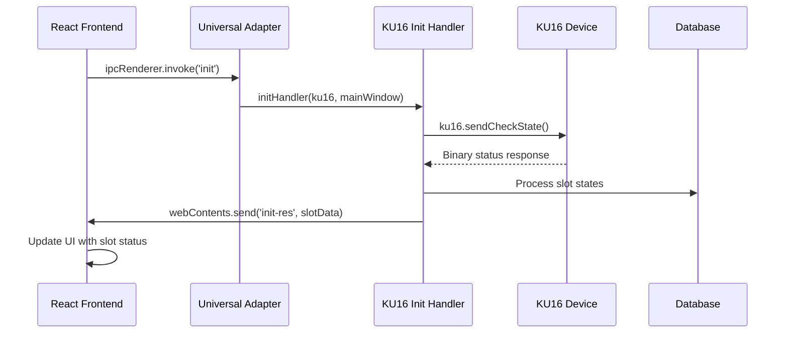

**Parameters**: Any  
**Returns**: void (sends `init-res` event)  
**Hardware Operation**: Triggers status check command `[0x02, 0x00, 0x30, 0x03, 0x35]`

#### 2. Slot Unlock - `unlock`
**File**: `main/ku16/ipcMain/unlock.ts:10`
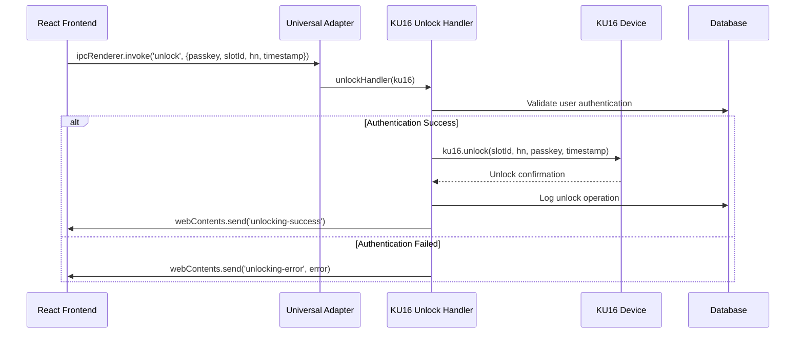

**Parameters**: `{passkey: string, slotId: number, hn: string, timestamp: number}`  
**Returns**: void (sends success/error events)  
**Hardware Operation**: Channel-specific unlock command based on slot ID

#### 3. Medication Dispensing - `dispense`
**File**: `main/ku16/ipcMain/dispensing.ts:10`
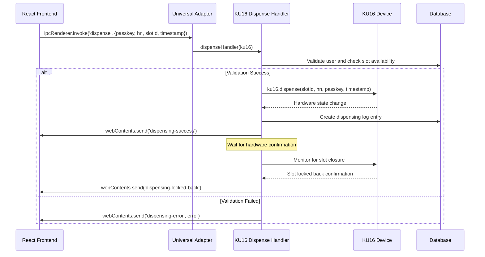

**Parameters**: `{passkey: string, hn: string, slotId: number, timestamp: number}`  
**Returns**: void (sends success/error events)  
**Hardware Operation**: Sets dispensing mode and monitors slot closure

#### 4. Continue Dispensing - `dispense-continue`
**File**: `main/ku16/ipcMain/dispensing-continue.ts:10`
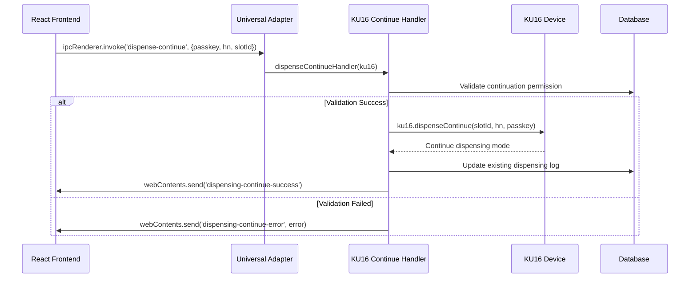

**Parameters**: `{passkey: string, hn: string, slotId: number}`  
**Returns**: void (sends success/error events)  
**Hardware Operation**: Continues existing dispensing session

#### 5. Slot Reset - `reset`
**File**: `main/ku16/ipcMain/reset.ts:10`
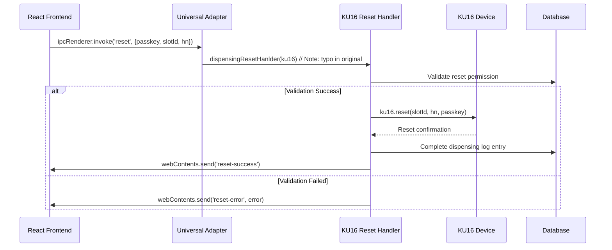

**Parameters**: `{passkey: string, slotId: number, hn: string}`  
**Returns**: void (sends success/error events)  
**Hardware Operation**: Resets slot state after successful dispensing

#### 6. Force Reset - `force-reset`
**File**: `main/ku16/ipcMain/forceReset.ts:10`
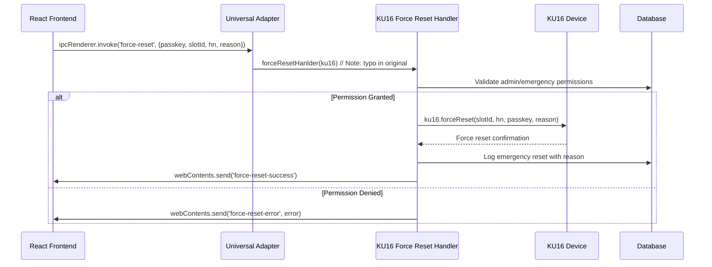

**Parameters**: `{passkey: string, slotId: number, hn: string, reason: string}`  
**Returns**: void (sends success/error events)  
**Hardware Operation**: Emergency reset bypassing normal checks

#### 7. Lock Status Check - `check-locked-back`
**File**: `main/ku16/ipcMain/checkLockedBack.ts:9`
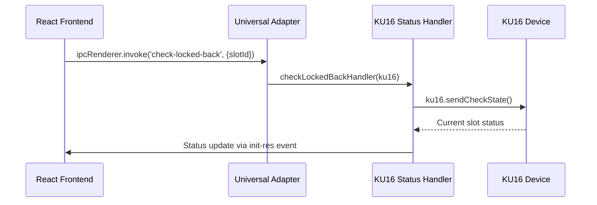

**Parameters**: `{slotId: number}`  
**Returns**: void (triggers status check)  
**Hardware Operation**: Queries current hardware state

### Administrative Operations (Now Universal)

#### 8. Admin Deactivation - `deactivate-admin`
**File**: `main/ku16/ipcMain/deactivate-admin.ts:12`
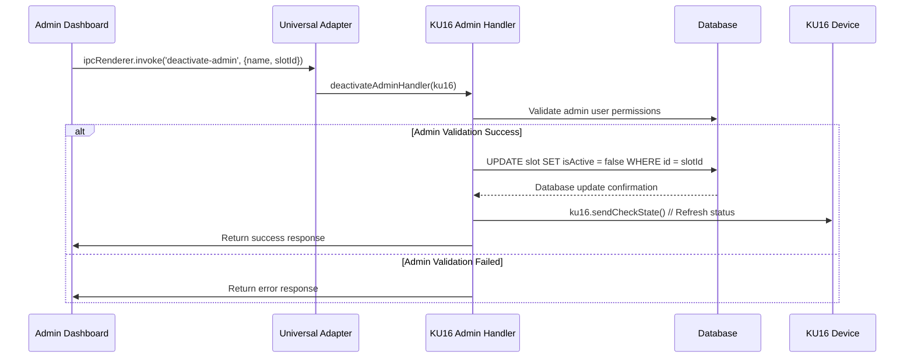

**Parameters**: `{name: string, slotId: number}`  
**Returns**: `Promise<any>` (database result or error)  
**Database Operation**: Updates slot active status

#### 9. Bulk Deactivation - `deactivate-all`
**File**: `main/ku16/ipcMain/deactivateAll.ts:12`
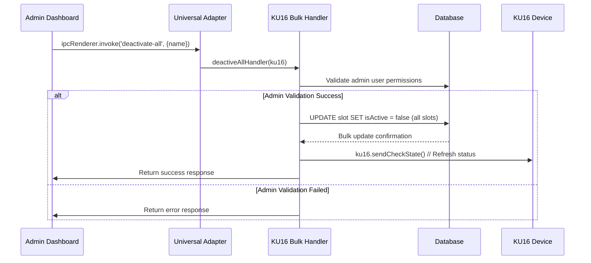

**Parameters**: `{name: string}`  
**Returns**: `Promise<any>` (database result or error)  
**Database Operation**: Bulk deactivation of all slots

#### 10. Admin Reactivation - `reactivate-admin`
**File**: `main/ku16/ipcMain/reactivate-admin.ts:12`


**Parameters**: `{name: string, slotId: number}`  
**Returns**: `Promise<any>` (database result or error)  
**Database Operation**: Reactivates specific slot

#### 11. Bulk Reactivation - `reactivate-all`
**File**: `main/ku16/ipcMain/reactiveAll.ts:12`
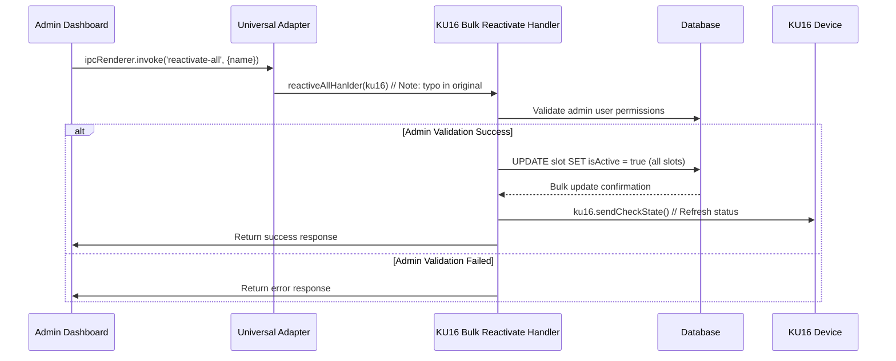

**Parameters**: `{name: string}`  
**Returns**: `Promise<any>` (database result or error)  
**Database Operation**: Bulk reactivation of all slots

### System Operations (Universal)

#### 12. Port Discovery - `get-port-list`
**File**: `main/ku16/ipcMain/getPortList.ts:8`
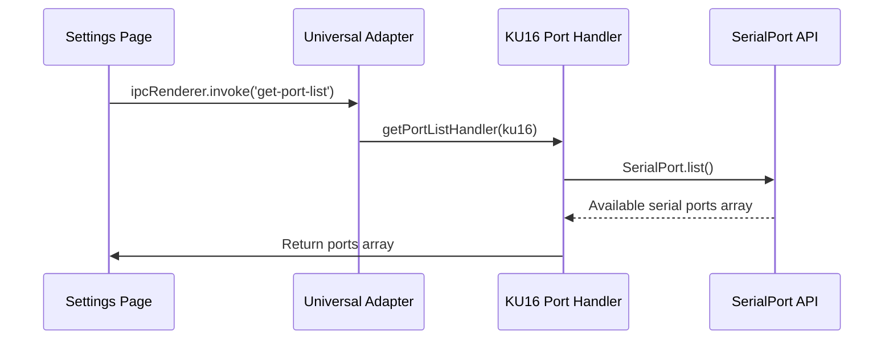

**Parameters**: Any  
**Returns**: `Promise<SerialPort[]>` (available serial ports)  
**System Operation**: Scans system for available serial communication ports

### Legacy Operations (KU16-Specific)

#### 13. Legacy Deactivation - `deactivate`
**File**: `main/ku16/ipcMain/deactivate.ts:10`
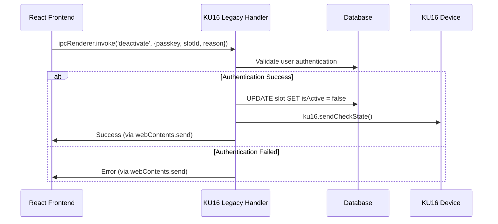

**Parameters**: `{passkey: string, slotId: number, reason: string}`  
**Returns**: void (sends events via webContents)  
**Status**: **Legacy** - May be deprecated in favor of universal adapter

## KU16 Hardware Communication Protocol

### Command Structure
KU16 uses a 5-byte binary command structure:
```
[STX, Channel, Command, ETX, Checksum]
[0x02, 0x00-0x0F, 0x30-0x3F, 0x03, calculated]
```

### Binary Command Examples
```typescript
// Status check command
const statusCommand = [0x02, 0x00, 0x30, 0x03, 0x35];

// Unlock commands (channel-specific)
const unlockChannel1 = [0x02, 0x01, 0x31, 0x03, 0x37];
const unlockChannel2 = [0x02, 0x02, 0x31, 0x03, 0x38];
// ... continues for 16 channels
```

### Response Parsing
**File**: `main/ku16/utils/command-parser.ts`

The KU16 system parses binary responses and converts them to decimal arrays for slot state processing:

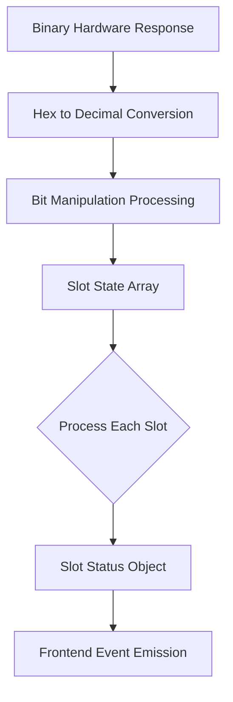

## KU16 State Management

### Internal State Flags
The KU16 class maintains several internal state flags:
- `opening`: Boolean flag for slot opening state
- `dispensing`: Boolean flag for dispensing mode
- `waitForLockedBack`: Boolean flag waiting for slot closure

### Hardware State Machine
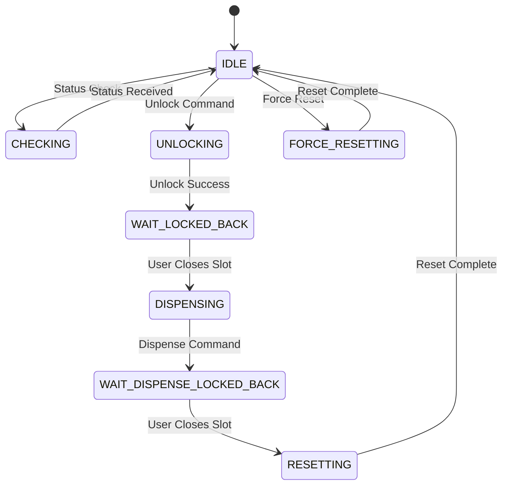

## Error Handling Patterns

### Authentication Errors
- Invalid passkey validation
- User not found in database
- Insufficient permissions for admin operations

### Hardware Errors
- Serial communication timeouts
- Invalid hardware responses
- Connection failures

### Business Logic Errors
- Slot already in use
- Invalid slot ID
- Operation not allowed in current state

## Event Emission Patterns

### Standard Events
- `init-res`: Slot status updates (consistent across all operations)
- `{operation}-success`: Operation completion confirmation
- `{operation}-error`: Operation failure notification

### Error Event Structure
```javascript
// Sent via webContents.send()
{
  error: "Error message",
  slotId: number,
  operation: "unlock|dispense|reset|etc",
  timestamp: Date.now()
}
```

## Performance Characteristics

### Communication Speed
- **Baud Rate**: 19200 (configurable)
- **Command Latency**: ~100-200ms per operation
- **Status Check Frequency**: On-demand basis

### Resource Usage
- **Memory**: Minimal footprint with direct hardware communication
- **CPU**: Low usage with simple binary protocol processing
- **Connection**: Persistent serial connection maintained

## Migration to Universal Adapters

**Important**: As of the current architecture, KU16 IPC handlers are now managed through Universal Adapters. The direct KU16 handlers documented above serve as the underlying implementation that universal adapters route to.

### Universal Adapter Benefits for KU16:
1. **Backward Compatibility**: Existing KU16 installations continue working
2. **Code Organization**: Centralized IPC management
3. **Future Flexibility**: Easy to add new hardware types
4. **Consistent Interface**: Same frontend code works for all hardware

### Handler Registration Flow:
```typescript
// In main/background.ts:203
registerUniversalAdapters(ku16Instance, null, mainWindow);

// Universal adapters automatically detect KU16 and route accordingly
if (hardwareInfo.type === 'KU16' && ku16Instance) {
  return await ku16Instance.operationMethod(payload);
}
```

---

**KU16 Status**: ✅ **Fully Supported via Universal Adapters**  
**Legacy Handlers**: Available but routed through universal system  
**Frontend Compatibility**: 100% maintained with universal adapters  
**Hardware Communication**: Direct binary serial protocol at 19200 baud