# User Workflow & Business Logic Documentation

## Overview

This document maps the complete user journey through the Smart Medication Cart system, from empty slot to medication dispensing, including all state transitions and business rules.

## User Personas & Access Levels

### 1. Healthcare Staff (Primary Users)
- **Access**: No login required, passkey per operation
- **Permissions**: Unlock slots, dispense medication, view slot status
- **Use Cases**: Daily medication loading and patient dispensing

### 2. System Administrators
- **Access**: Dashboard authentication required
- **Permissions**: All staff permissions + slot management, user management, system settings
- **Use Cases**: System maintenance, audit log review, emergency slot control

## Complete User Workflow

### Phase 1: Medication Loading Workflow

#### Step 1: Empty Slot Identification
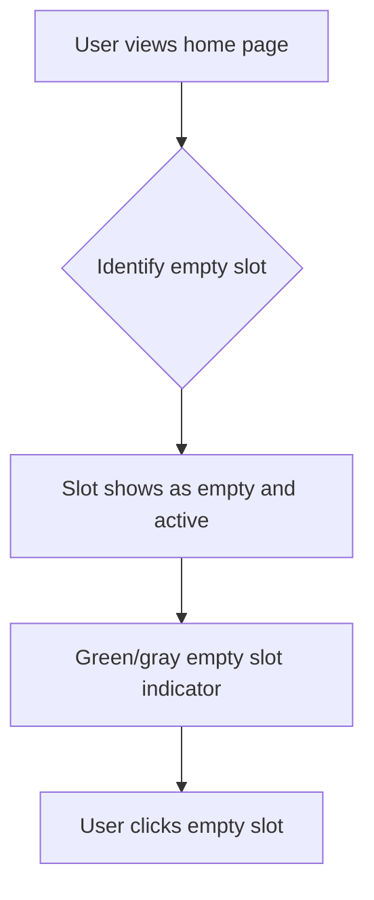

**UI State**: `/renderer/pages/home.tsx` - 15 slots displayed in 5x3 grid
**Business Rule**: Only 15 slots shown (hardware supports 16 but slot 16 unused)

#### Step 2: Input Modal - Medication Assignment
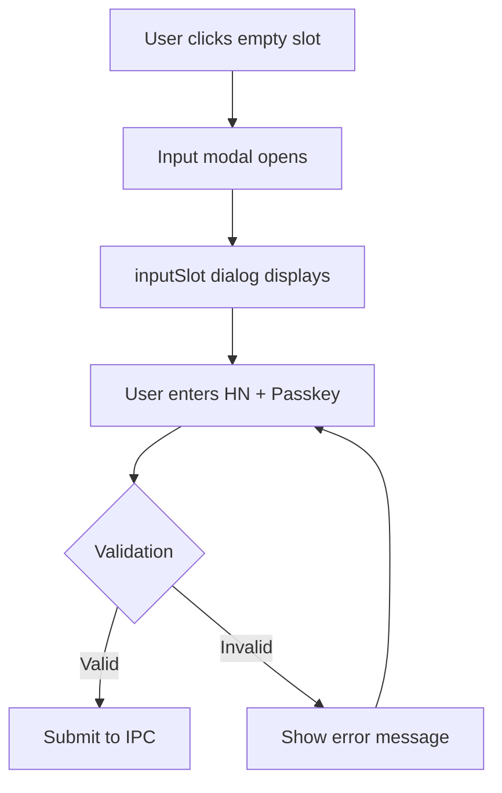

**Component**: `/renderer/components/Dialogs/inputSlot.tsx` (✅ Enhanced with Production Design System)
**IPC Event**: `unlock-req` with `{ slotId, hn, passkey, timestamp }`

**Production UI/UX Features (Currently Deployed)**:
- ✅ **Centralized Design System**: Complete integration with `DialogBase`, `DialogHeader`, and form elements
- ✅ **React Hook Form Validation**: Production-ready form validation with real-time visual feedback
- ✅ **Loading States**: Integrated loading animations with medical-grade user feedback
- ✅ **Enhanced Error Handling**: Thai language error messages with comprehensive validation
- ✅ **Accessibility Compliance**: High contrast design for medical environments

**Production Form Implementation**:
```typescript
// Production React Hook Form integration with comprehensive validation
const { register, handleSubmit, formState: { errors } } = useForm<Inputs>();

const onSubmit: SubmitHandler<Inputs> = (data) => {
  console.log("🔍 InputSlot Form Submit - Data:", data);
  
  // Enhanced validation with Thai language feedback
  if (data.passkey === "") {
    toast.error("กรุณากรอกรหัสผู้ใช้");
    return;
  }

  // Business logic validation with duplicate checking
  if (!checkDuplicate(data.hn)) {
    toast.error("ไม่สามารถลงทะเบียนซ้ำได้");
    return;
  }
  
  unlock(slotNo, data.hn, data.passkey);
  onClose();
};

// Production Design System components
<DialogInput
  placeholder="รหัสผู้ป่วย"
  error={errors.hn ? "กรุณากรอกรหัสผู้ป่วย" : undefined}
  {...register("hn", { required: true })}
/>

<DialogButton type="submit" variant="primary" icon="✓">
  ตกลง
</DialogButton>
```

**Validation Rules**:
- HN (Hospital Number): Required, patient identifier
- Passkey: Required, user authentication
- Slot must be empty and active

#### Step 3: Hardware Unlock Process
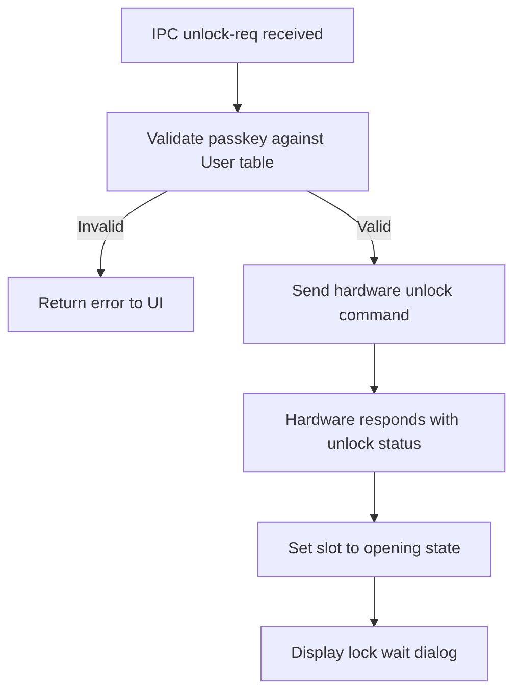

**IPC Handler**: `/main/ku16/ipcMain/unlock.ts`
**Hardware Command**: `cmdUnlock(slotId)` in `/main/ku16/utils/command-parser.ts`
**State Change**: 
- Database: `Slot.update({ hn, occupied: false, opening: true })`
- UI: Show `LockWait` dialog component

#### Step 4: Lock Wait Dialog - User Confirmation
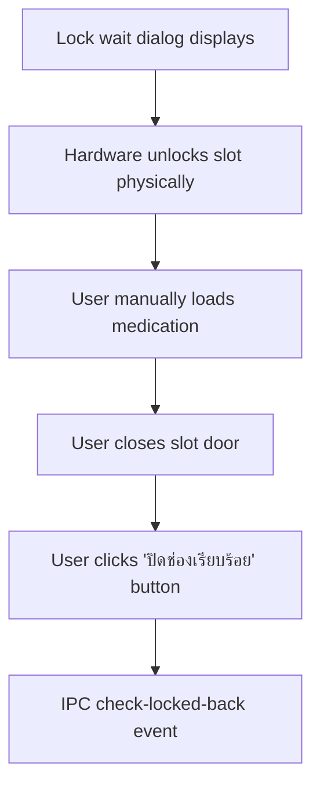

**Component**: `/renderer/components/Dialogs/lockWait.tsx` (✅ Production Design System Integration)
**Business Logic**: Manual confirmation with enhanced user guidance
**Safety Feature**: Emergency deactivate with improved visual feedback

**Production User Experience Features (Currently Live)**:
- ✅ **Advanced Status Indicators**: Color-coded status with pulsing animations for active states
- ✅ **Multi-Step Progress**: Visual step progression with "Step 1 of 2" indicators
- ✅ **Enhanced Loading States**: Medical-grade feedback during hardware operations
- ✅ **Comprehensive Instructions**: Thai language guidance with icon-based visual cues
- ✅ **Emergency Controls**: Improved deactivation interface with safety confirmations

#### Step 5: Slot State Confirmation
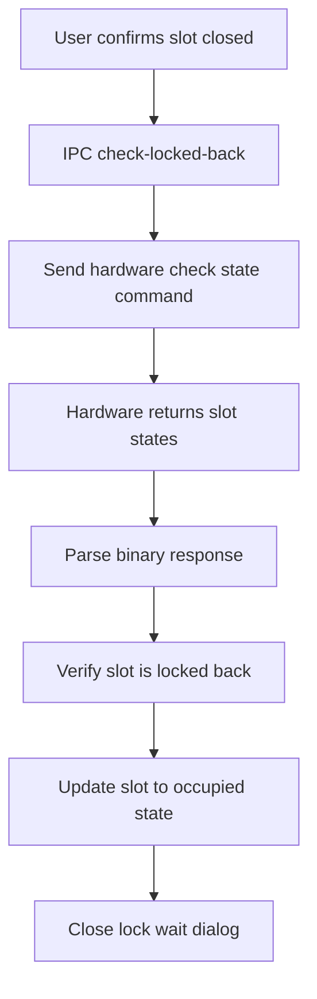

**IPC Handler**: `/main/ku16/ipcMain/checkLockedBack.ts`
**Hardware Method**: `ku16.sendCheckState()` and `receivedLockedBackState()`
**Final State**: `Slot.update({ occupied: true, opening: false })`
**UI Update**: Slot displays as locked with medication info

### Phase 2: Medication Dispensing Workflow

#### Step 1: Occupied Slot Selection
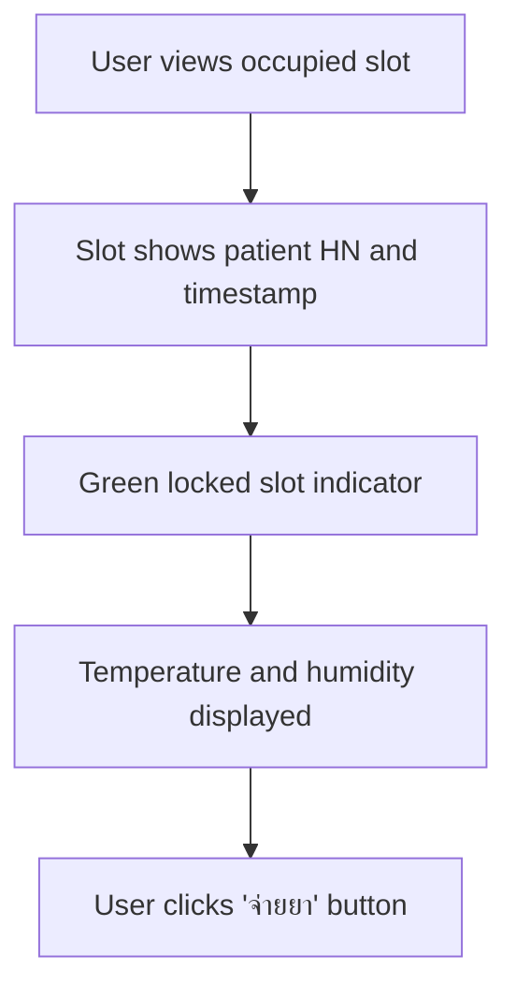

**Component**: `/renderer/components/Slot/locked.tsx`
**Display Info**:
- Patient HN
- Date/time of medication loading
- Current temperature and humidity
- "จ่ายยา" (Dispense) button

#### Step 2: Dispense Modal - Patient Verification
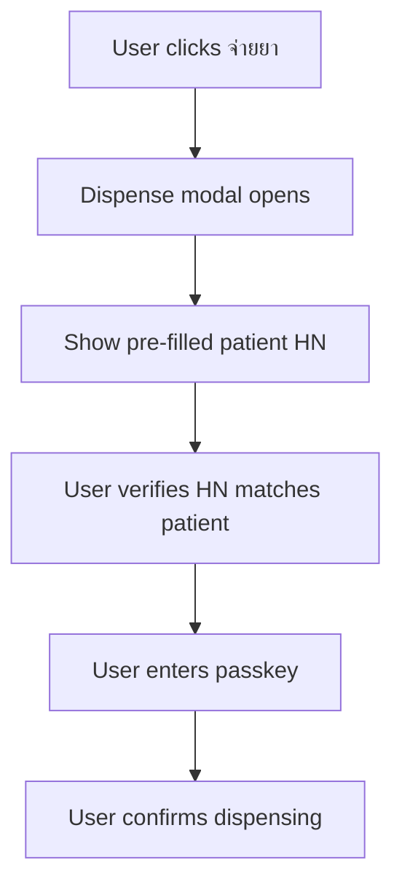

**Component**: `/renderer/components/Dialogs/dispenseSlot.tsx`
**Business Rule**: HN pre-filled from slot data, user must verify correctness
**Security**: Passkey required for each dispense operation

#### Step 3: Hardware Dispense Process
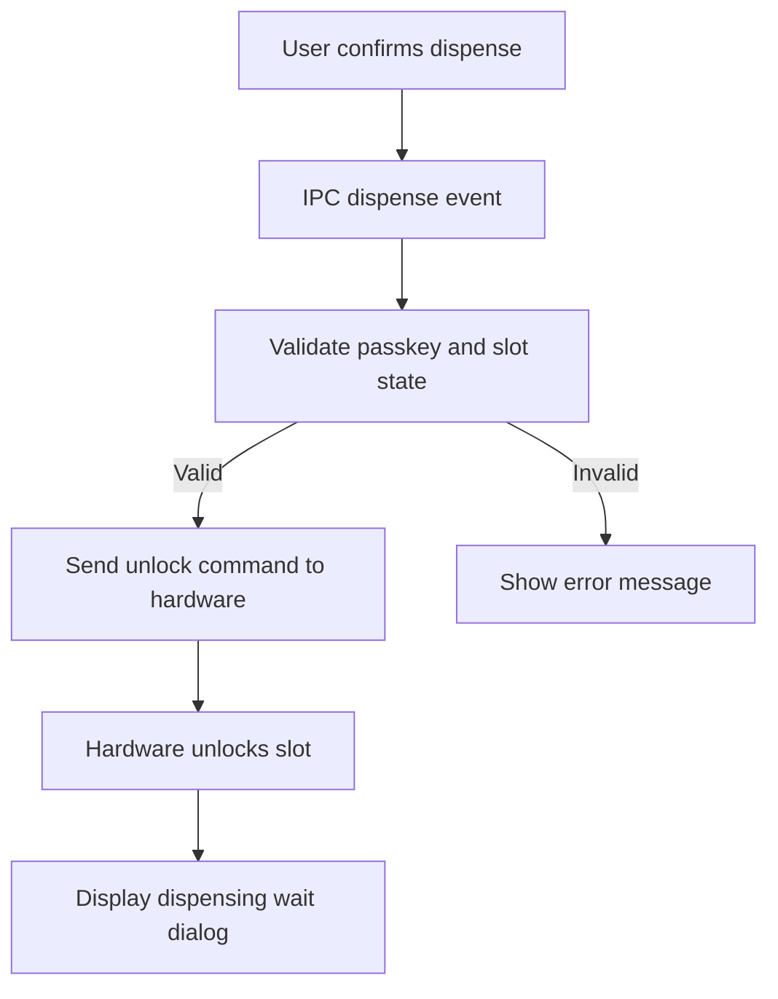

**IPC Handler**: `/main/ku16/ipcMain/dispensing.ts`
**Validation Rules**:
- Slot must be occupied
- HN must not be empty/null
- User passkey must exist in database
- Hardware must be connected

#### Step 4: Dispensing Wait Dialog
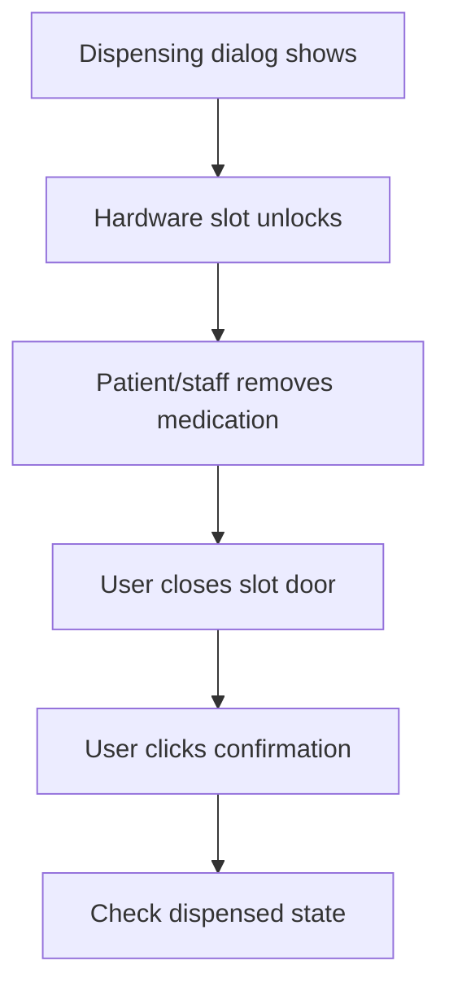

**Component**: `/renderer/components/Dialogs/dispensingWait.tsx` (✅ Production Design System Deployed)
**User Action**: Enhanced manual confirmation with comprehensive validation
**Safety Feature**: Improved emergency controls with visual feedback

**Production Dispensing Experience (Currently Live)**:
- ✅ **Advanced Progress Indicators**: Multi-step visual progress with color-coded feedback system
- ✅ **Real-time Status Display**: Dynamic slot status with animated feedback (red="เปิดอยู่" with medical-grade pulsing)
- ✅ **Icon-based Instructions**: Clear numbered workflow guidance with visual icons for medical compliance
- ✅ **Medical-Grade Loading States**: Professional loading animations with descriptive Thai language feedback
- ✅ **Comprehensive Error Handling**: Production-ready error validation with user-friendly messaging

**Production Dispensing Dialog Implementation**:
```typescript
// Production status display with enhanced feedback
<StatusIndicator
  status="error"        // Medical-grade red status for slot open state
  message="เปิดอยู่"      // Thai language compliance messaging
  slotNo={slotNo}       // Automated slot number formatting
  animated={true}       // Medical device standard pulsing animation
/>

// Production loading button with comprehensive state management
<DialogButton
  variant="primary"
  loading={isCheckingLock}    // Integrated loading state management
  disabled={isCheckingLock}   // Prevent multiple submissions
  onClick={handleCheckLockedBack}
  icon={!isCheckingLock ? "✓" : undefined}
>
  {isCheckingLock ? "กำลังตรวจสอบการปิดช่อง..." : "ตกลง"}
</DialogButton>

// Enhanced error handling with validation
const handleCheckLockedBack = () => {
  if (!slotNo || !hn) {
    toast.error("ข้อมูลไม่ครบถ้วน กรุณาเริ่มกระบวนการใหม่");
    return;
  }
  
  setIsCheckingLock(true);
  
  ipcRenderer
    .invoke("check-locked-back", { slotId: slotNo, hn: hn })
    .then(() => setIsCheckingLock(false))
    .catch((error) => {
      toast.error("ไม่สามารถตรวจสอบการปิดช่องได้: " + error.message);
      setIsCheckingLock(false);
    });
};
```

#### Step 5: Post-Dispense Decision
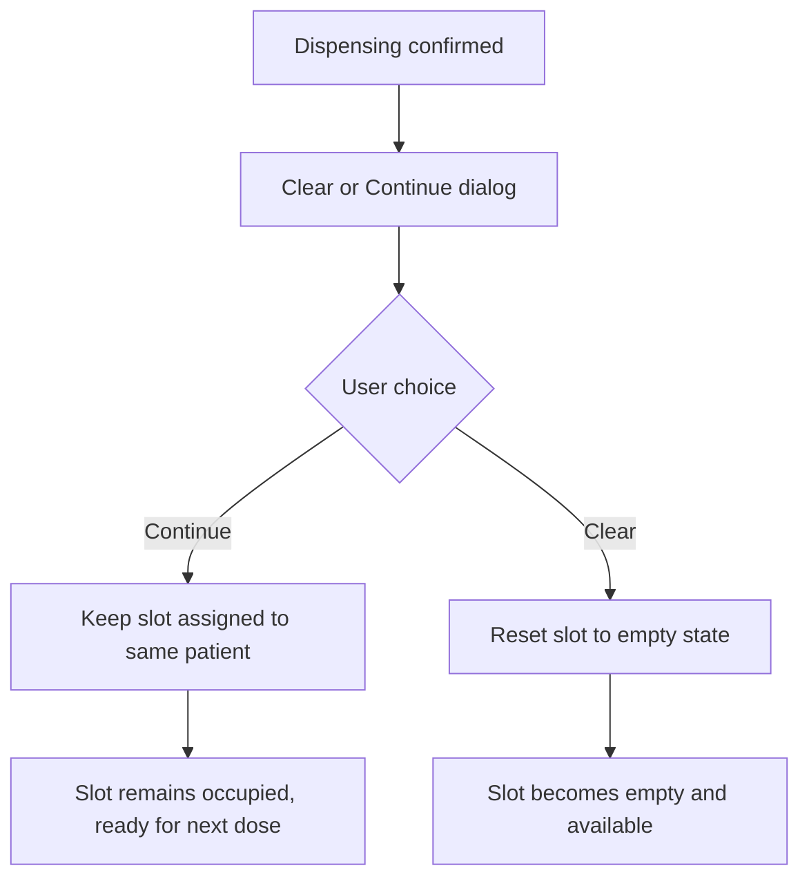

**Component**: `/renderer/components/Dialogs/clearOrContinue.tsx`
**Business Options**:
- **Continue**: Multi-dose medication, keep slot assigned to patient
- **Clear**: Single dose complete, slot available for new patient

### Admin Dashboard Workflow

#### Access Control
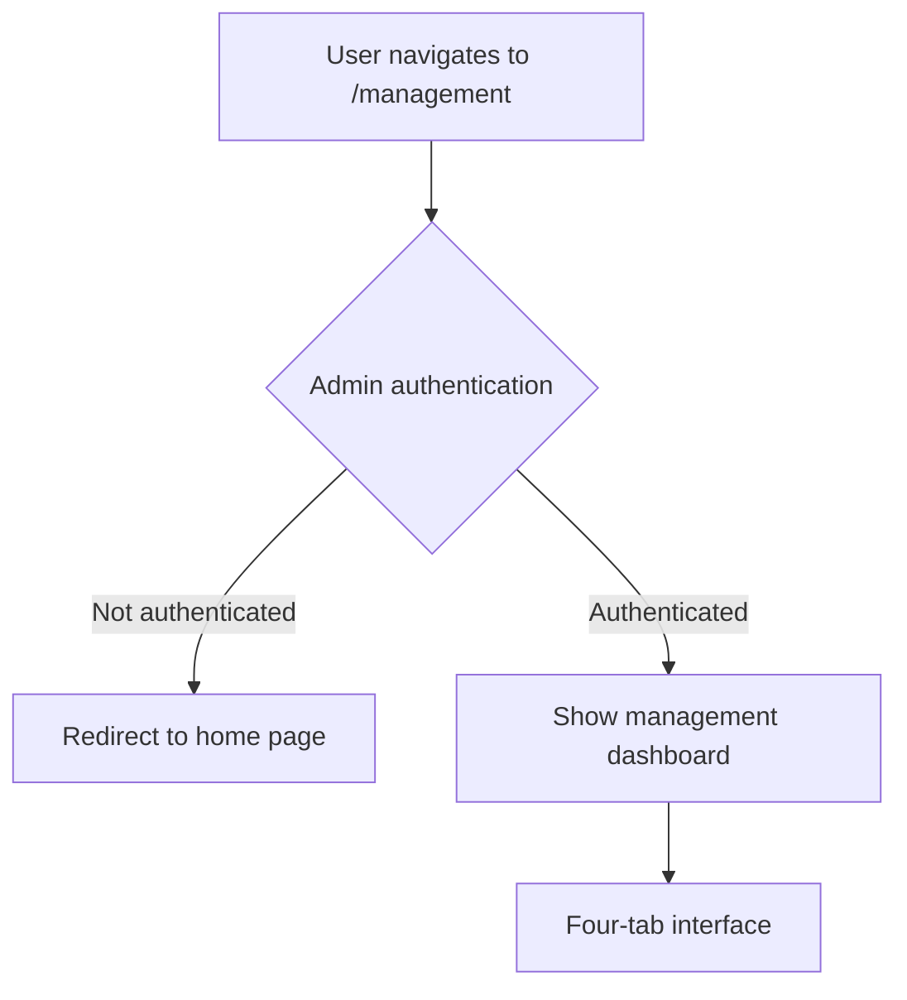

**Route**: `/renderer/pages/management/index.tsx`
**Authentication**: Context-based admin session management

#### Tab 1: Slot Management (จัดการช่องยา)
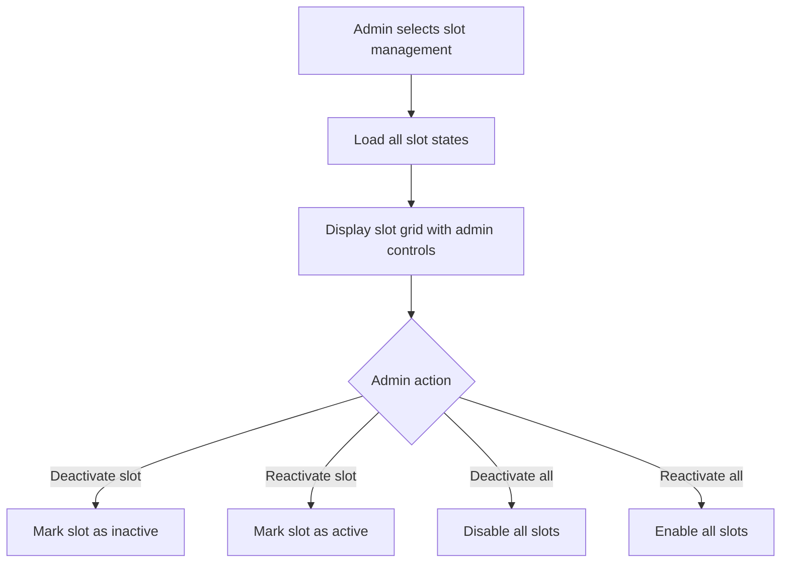

**Functions**:
- Individual slot deactivation/reactivation
- Bulk operations for system maintenance
- Emergency slot control for malfunctions

#### Tab 2: User Management (จัดการผู้ใช้งาน)
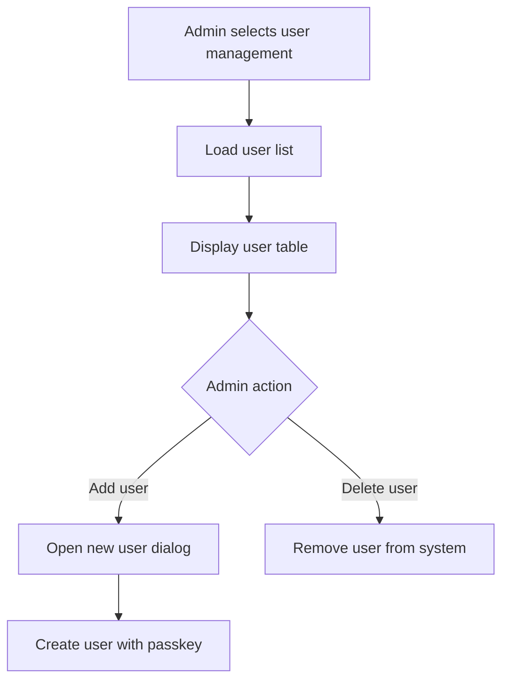

**Business Rules**:
- Maximum users limited by `setting.max_log_counts`
- Each user requires unique passkey
- User deletion requires admin confirmation

#### Tab 3: System Settings (จัดการการตั้งค่าระบบ)
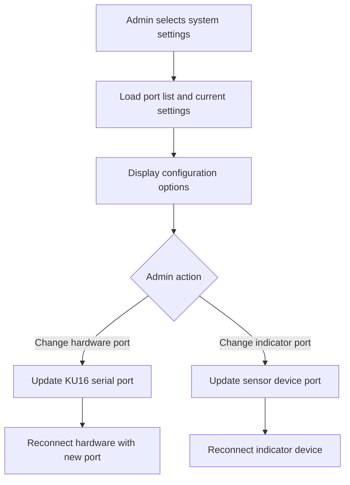

**Configuration Items**:
- Serial port selection for hardware communication
- Indicator device port for temperature/humidity sensors
- Baud rate settings (typically 19200 for DS12, 115200 for DS16)

#### Tab 4: Logs Management (จัดการ Logs)
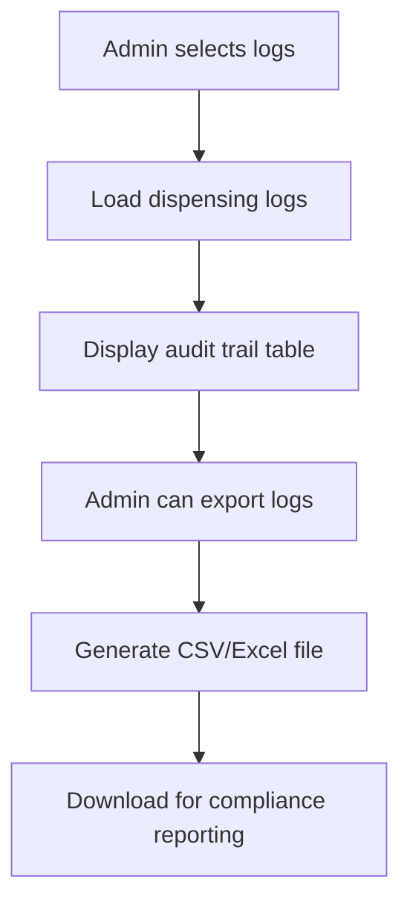

**Audit Information**:
- All unlock/dispense operations
- User identification and timestamps
- Slot numbers and patient HNs
- Operation types and results

## State Management & Data Flow

### Database State Transitions
```sql
-- Empty slot ready for medication
{ slotId: 1, hn: null, occupied: false, opening: false, isActive: true }

-- Slot unlocking for medication loading  
{ slotId: 1, hn: "HN123456", occupied: false, opening: true, isActive: true }

-- Slot locked with medication loaded
{ slotId: 1, hn: "HN123456", occupied: true, opening: false, isActive: true }

-- Slot unlocking for dispensing
{ slotId: 1, hn: "HN123456", occupied: true, opening: true, isActive: true }

-- Options after dispensing:
-- A) Continue - keep medication assignment
{ slotId: 1, hn: "HN123456", occupied: true, opening: false, isActive: true }

-- B) Clear - reset slot to empty
{ slotId: 1, hn: null, occupied: false, opening: false, isActive: true }

-- Emergency deactivation
{ slotId: 1, hn: null, occupied: false, opening: false, isActive: false }
```

### IPC Event Flow
```typescript
// Unlock request flow
"unlock-req" → unlock validation → hardware command → "unlocking" event

// Lock confirmation flow  
"check-locked-back" → hardware check → state update → UI update

// Dispense request flow
"dispense" → validation → unlock command → "dispensing" event

// Dispense confirmation flow
"dispensing-continue" → choice handling → state update
```

### UI State Synchronization
The UI maintains real-time synchronization with hardware through:
1. **IPC Events**: Main process sends updates to renderer
2. **React Hooks**: `useKuStates()`, `useUnlock()`, `useDispense()`
3. **Context Management**: Global state for authentication and indicators
4. **Modal State**: Local component state for dialog management

## Error Handling & Safety Features

### Hardware Communication Errors
- **Connection Loss**: Graceful degradation, retry mechanisms
- **Command Timeout**: User notification, manual retry options
- **Invalid Response**: Error logging, safe state preservation

### User Safety Features
- **Emergency Deactivation**: Immediately disable malfunctioning slots
- **Passkey Validation**: Prevent unauthorized operations
- **State Confirmation**: Manual verification prevents false positives
- **Audit Logging**: Complete operation traceability

### Medical Compliance Features
- **Comprehensive Logging**: Every operation recorded with full context
- **Data Persistence**: SQLite database for audit trail preservation  
- **Export Capabilities**: Compliance reporting support
- **Regulatory Standards**: Designed for healthcare environment requirements

This workflow documentation provides the complete understanding needed for safe refactoring while preserving medical device functionality and user experience patterns.