# User Workflow & Business Logic Documentation

## Overview

This document maps the complete user journey through the Smart Medication Cart system, from empty slot to medication dispensing, including all state transitions and business rules.

## User Personas & Access Levels

### 1. Healthcare Staff (Primary Users)
- **Access**: No login required, passkey per operation
- **Permissions**: Unlock slots, dispense medication, view slot status
- **Use Cases**: Daily medication loading and patient dispensing

### 2. System Administrators
- **Access**: Dashboard authentication required
- **Permissions**: All staff permissions + slot management, user management, system settings
- **Use Cases**: System maintenance, audit log review, emergency slot control

## Complete User Workflow

### Phase 1: Medication Loading Workflow

#### Step 1: Empty Slot Identification


**UI State**: `/renderer/pages/home.tsx` - 15 slots displayed in 5x3 grid
**Business Rule**: Only 15 slots shown (hardware supports 16 but slot 16 unused)

#### Step 2: Input Modal - Medication Assignment


**Component**: `/renderer/components/Dialogs/inputSlot.tsx` (Enhanced with Design System)
**IPC Event**: `unlock-req` with `{ slotId, hn, passkey, timestamp }`

**Enhanced UI/UX Features (Latest Update)**:
- **Design System Integration**: Consistent dialog layout with `DialogBase`, `DialogHeader`, and enhanced form elements
- **React Hook Form Validation**: Real-time form validation with visual error feedback
- **Loading States**: Button shows loading animation during IPC operations
- **Error Handling**: Immediate visual feedback for validation errors with Thai language messages

**Enhanced Form Experience**:
```typescript
// React Hook Form integration with enhanced validation
const { register, handleSubmit, formState: { errors } } = useForm<Inputs>();

// Visual error feedback in real-time
<DialogInput
  placeholder="รหัสผู้ป่วย"
  error={errors.hn ? "กรุณากรอกรหัสผู้ป่วย" : undefined}
  {...register("hn", { required: true })}
/>

// Enhanced submit button with loading states
<DialogButton type="submit" variant="primary" icon="✓">
  ตกลง
</DialogButton>
```

**Validation Rules**:
- HN (Hospital Number): Required, patient identifier
- Passkey: Required, user authentication
- Slot must be empty and active

#### Step 3: Hardware Unlock Process


**IPC Handler**: `/main/ku16/ipcMain/unlock.ts`
**Hardware Command**: `cmdUnlock(slotId)` in `/main/ku16/utils/command-parser.ts`
**State Change**: 
- Database: `Slot.update({ hn, occupied: false, opening: true })`
- UI: Show `LockWait` dialog component

#### Step 4: Lock Wait Dialog - User Confirmation

```mermaid
graph TD
    A[Lock wait dialog displays] --> B[Hardware unlocks slot physically]
    B --> C[User manually loads medication]
    C --> D[User closes slot door]
    D --> E[User clicks 'ปิดช่องเรียบร้อย' button]
    E --> F[IPC check-locked-back event]
```


**Component**: `/renderer/components/Dialogs/lockWait.tsx` (Enhanced with Design System)
**Business Logic**: Manual confirmation required (no real-time hardware monitoring to save resources)
**Safety Feature**: Emergency deactivate button available if slot malfunctions

**Enhanced User Experience Features**:
- **Status Indicator Integration**: Visual slot status with color-coded feedback (green=success, red=error)
- **Progress Indication**: Clear step progression display (Step 1 of 2)
- **Loading Animations**: Visual feedback during hardware verification
- **Enhanced Instructions**: Clear Thai language step-by-step guidance with icons

#### Step 5: Slot State Confirmation


**IPC Handler**: `/main/ku16/ipcMain/checkLockedBack.ts`
**Hardware Method**: `ku16.sendCheckState()` and `receivedLockedBackState()`
**Final State**: `Slot.update({ occupied: true, opening: false })`
**UI Update**: Slot displays as locked with medication info

### Phase 2: Medication Dispensing Workflow

#### Step 1: Occupied Slot Selection

```mermaid
graph TD
    A[User views occupied slot] --> B[Slot shows patient HN and timestamp]
    B --> C[Green locked slot indicator]
    C --> D[Temperature and humidity displayed]
    D --> E[User clicks 'จ่ายยา' button]
```


**Component**: `/renderer/components/Slot/locked.tsx`
**Display Info**:
- Patient HN
- Date/time of medication loading
- Current temperature and humidity
- "จ่ายยา" (Dispense) button

#### Step 2: Dispense Modal - Patient Verification

```mermaid
graph TD
    A[User clicks จ่ายยา] --> B[Dispense modal opens]
    B --> C[Show pre-filled patient HN]
    C --> D[User verifies HN matches patient]
    D --> E[User enters passkey]
    E --> F[User confirms dispensing]
```


**Component**: `/renderer/components/Dialogs/dispenseSlot.tsx`
**Business Rule**: HN pre-filled from slot data, user must verify correctness
**Security**: Passkey required for each dispense operation

#### Step 3: Hardware Dispense Process


**IPC Handler**: `/main/ku16/ipcMain/dispensing.ts`
**Validation Rules**:
- Slot must be occupied
- HN must not be empty/null
- User passkey must exist in database
- Hardware must be connected

#### Step 4: Dispensing Wait Dialog


**Component**: `/renderer/components/Dialogs/dispensingWait.tsx` (Enhanced with Design System)
**User Action**: Manual confirmation that medication was retrieved
**Safety Feature**: Emergency deactivate available

**Enhanced Dispensing Experience**:
- **Multi-Step Progress**: Visual step indicators showing "Step 1 of 2" with progress colors
- **Status Indicator**: Real-time slot status with color-coded feedback (red="เปิดอยู่" with pulsing animation)
- **Enhanced Instructions**: Clear numbered steps with icons (📋 Instructions: 1. เอายาออกจากช่อง 2. ปิดช่องให้แน่น 3. กดปุ่ม "ตกลง")
- **Loading States**: Button shows loading animation during hardware verification with descriptive text
- **Error Handling**: Enhanced error validation with user-friendly Thai language messages

**Dispensing Wait Dialog Features**:
```typescript
// Enhanced status display
<StatusIndicator
  status="error"        // Red background for slot open state
  message="เปิดอยู่"      // Clear status message in Thai
  slotNo={slotNo}       // Automatic slot number formatting
  animated={true}       // Pulsing animation for active state
/>

// Loading button with state management
<DialogButton
  variant="primary"
  loading={isCheckingLock}    // Loading state management
  onClick={handleCheckLockedBack}
  icon={!isCheckingLock ? "✓" : undefined}
>
  {isCheckingLock ? "กำลังตรวจสอบการปิดช่อง..." : "ตกลง"}
</DialogButton>
```

#### Step 5: Post-Dispense Decision


**Component**: `/renderer/components/Dialogs/clearOrContinue.tsx`
**Business Options**:
- **Continue**: Multi-dose medication, keep slot assigned to patient
- **Clear**: Single dose complete, slot available for new patient

### Admin Dashboard Workflow

#### Access Control


**Route**: `/renderer/pages/management/index.tsx`
**Authentication**: Context-based admin session management

#### Tab 1: Slot Management (จัดการช่องยา)


**Functions**:
- Individual slot deactivation/reactivation
- Bulk operations for system maintenance
- Emergency slot control for malfunctions

#### Tab 2: User Management (จัดการผู้ใช้งาน)


**Business Rules**:
- Maximum users limited by `setting.max_log_counts`
- Each user requires unique passkey
- User deletion requires admin confirmation

#### Tab 3: System Settings (จัดการการตั้งค่าระบบ)


**Configuration Items**:
- Serial port selection for hardware communication
- Indicator device port for temperature/humidity sensors
- Baud rate settings (typically 19200 for DS12, 115200 for DS16)

#### Tab 4: Logs Management (จัดการ Logs)


**Audit Information**:
- All unlock/dispense operations
- User identification and timestamps
- Slot numbers and patient HNs
- Operation types and results

## State Management & Data Flow

### Database State Transitions
```sql
-- Empty slot ready for medication
{ slotId: 1, hn: null, occupied: false, opening: false, isActive: true }

-- Slot unlocking for medication loading  
{ slotId: 1, hn: "HN123456", occupied: false, opening: true, isActive: true }

-- Slot locked with medication loaded
{ slotId: 1, hn: "HN123456", occupied: true, opening: false, isActive: true }

-- Slot unlocking for dispensing
{ slotId: 1, hn: "HN123456", occupied: true, opening: true, isActive: true }

-- Options after dispensing:
-- A) Continue - keep medication assignment
{ slotId: 1, hn: "HN123456", occupied: true, opening: false, isActive: true }

-- B) Clear - reset slot to empty
{ slotId: 1, hn: null, occupied: false, opening: false, isActive: true }

-- Emergency deactivation
{ slotId: 1, hn: null, occupied: false, opening: false, isActive: false }
```

### IPC Event Flow
```typescript
// Unlock request flow
"unlock-req" → unlock validation → hardware command → "unlocking" event

// Lock confirmation flow  
"check-locked-back" → hardware check → state update → UI update

// Dispense request flow
"dispense" → validation → unlock command → "dispensing" event

// Dispense confirmation flow
"dispensing-continue" → choice handling → state update
```

### UI State Synchronization
The UI maintains real-time synchronization with hardware through:
1. **IPC Events**: Main process sends updates to renderer
2. **React Hooks**: `useKuStates()`, `useUnlock()`, `useDispense()`
3. **Context Management**: Global state for authentication and indicators
4. **Modal State**: Local component state for dialog management

## Error Handling & Safety Features

### Hardware Communication Errors
- **Connection Loss**: Graceful degradation, retry mechanisms
- **Command Timeout**: User notification, manual retry options
- **Invalid Response**: Error logging, safe state preservation

### User Safety Features
- **Emergency Deactivation**: Immediately disable malfunctioning slots
- **Passkey Validation**: Prevent unauthorized operations
- **State Confirmation**: Manual verification prevents false positives
- **Audit Logging**: Complete operation traceability

### Medical Compliance Features
- **Comprehensive Logging**: Every operation recorded with full context
- **Data Persistence**: SQLite database for audit trail preservation  
- **Export Capabilities**: Compliance reporting support
- **Regulatory Standards**: Designed for healthcare environment requirements

This workflow documentation provides the complete understanding needed for safe refactoring while preserving medical device functionality and user experience patterns.