# Data Flow Patterns & State Management

## Overview

This document maps the complete data flow patterns within the Smart Medication Cart system, from user interactions to hardware operations. Understanding these patterns is critical for safe refactoring without compromising medical device state integrity or audit compliance.

## State Management Architecture

### Three-Layer State Synchronization

```
┌─────────────────────────────────────────────────────────────────┐
│                        UI LAYER (React)                        │
│ • Component State (useState, useForm)                          │
│ • Context State (Authentication, Dispensing)                   │ 
│ • Hook State (useKuStates, useUnlock, useDispense)            │
│ • Modal State (Dialog visibility, form data)                   │
└─────────────────────────────────────────────────────────────────┘
                        ▲ IPC Events ▼ IPC Calls
┌─────────────────────────────────────────────────────────────────┐
│                  BUSINESS LOGIC LAYER (Main)                   │
│ • Runtime State (KU16 class properties)                        │
│ • Session State (Authentication, device connections)           │
│ • Operation State (opening, dispensing, waitFor flags)         │
│ • Cache State (slot states, user sessions)                     │
└─────────────────────────────────────────────────────────────────┘
                        ▲ ORM Operations ▼ Database Queries
┌─────────────────────────────────────────────────────────────────┐
│                   DATABASE LAYER (SQLite)                      │
│ • Persistent State (Slot, User, Setting models)                │
│ • Audit Logs (DispensingLog, SystemLog)                       │
│ • Configuration State (Device settings, user preferences)      │
│ • Historical Data (Operation history, error logs)              │
└─────────────────────────────────────────────────────────────────┘
```

### State Synchronization Challenges

**1. State Redundancy Issues**:
- Same slot state exists in: Database → KU16 class → React hooks → Component state
- Risk of inconsistency during concurrent operations
- Need for atomic state updates across layers

**2. Race Condition Scenarios**:
- Hardware response arrives while UI is updating
- User actions trigger multiple overlapping hardware operations
- Database updates concurrent with IPC events

**3. Error Recovery Complexity**:
- Partial failures require rollback across all layers
- Hardware timeout during state transitions
- Database connection loss during critical operations

## Core Data Flow Patterns

### 1. System Initialization Flow

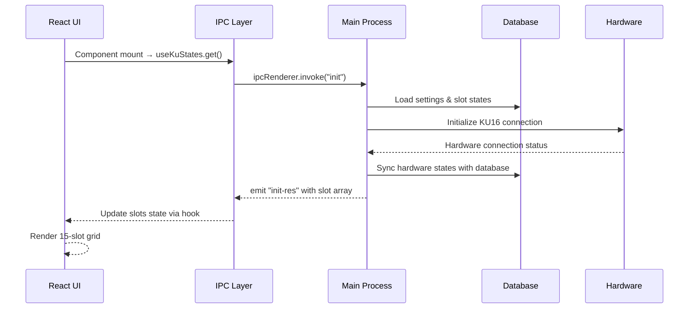

**Critical Files**:
- **Entry**: `/renderer/hooks/useKuStates.ts` → `get()` function
- **Handler**: `/main/ku16/ipcMain/init.ts`
- **Hardware**: `/main/ku16/index.ts` → `sendCheckState()`
- **Database**: Sequelize models via `/db/sequelize.ts`

**State Dependencies**:
```typescript
// Database State → Runtime State → UI State
const databaseSlots = await Slot.findAll();          // Database layer
ku16.updateInternalState(databaseSlots);             // Business logic layer
mainWindow.webContents.send('init-res', slotArray); // UI layer
```

### 2. Medication Loading (Unlock) Flow

#### Phase 1: User Input & Validation

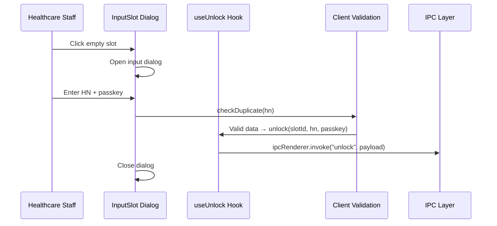

**Business Logic Validation**:
```typescript
// Client-side validation in inputSlot.tsx
const checkDuplicate = (hn: string) => {
  const found = slots.find((slot) => slot.hn == hn);
  return found == undefined && slots.length > 0 ? true : false;
};

// Passkey validation
if (data.passkey == "") {
  toast.error("กรุณากรอกรหัสผู้ใช้");
  return;
}
```

#### Phase 2: Server-side Processing & Hardware Control

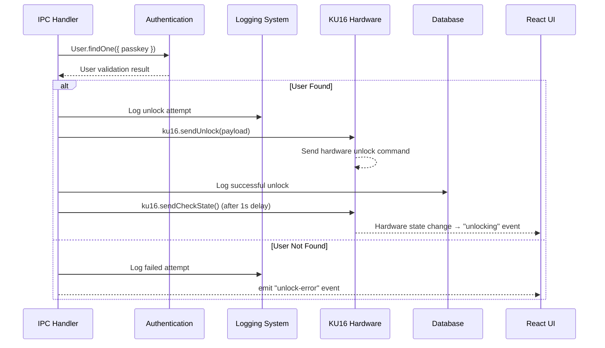

**Critical Error Handling**:
```typescript
// Server-side validation in unlock.ts
try {
  const user = await User.findOne({ where: { passkey: payload.passkey } });
  if (!user) {
    throw new Error("ไม่พบผู้ใช้งาน");
  }
  
  await ku16.sendUnlock(payload);
  await logDispensing({
    userId: userId,
    hn: payload.hn,
    slotId: payload.slotId,
    process: "unlock",
    message: "ปลดล็อคสำเร็จ"
  });
} catch (error) {
  // Error logging and UI notification
  ku16.win.webContents.send("unlock-error", {
    message: "ปลดล็อกไม่สำเร็จกรุณาตรวจสอบรหัสผู้ใช้งานอีกครั้ง"
  });
}
```

#### Phase 3: Hardware Response & UI Synchronization

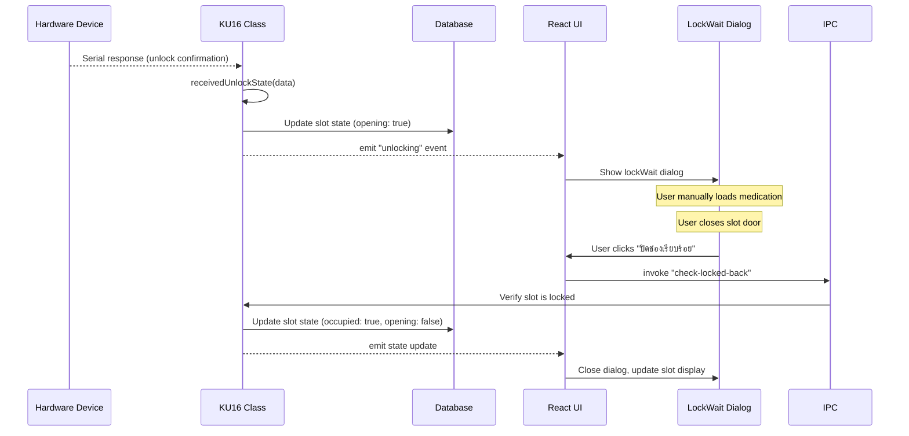

### 3. Medication Dispensing Flow

#### Phase 1: Patient Verification

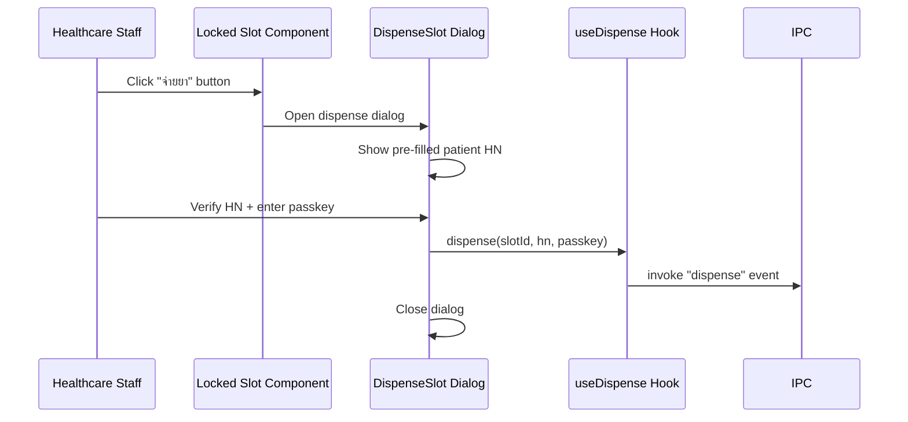

**Pre-filled Data Pattern**:
```typescript
// dispenseSlot.tsx - Patient HN pre-filled for verification
const DispenseSlot = ({ slotNo, hn, onClose }) => {
  const { dispense } = useDispense();
  
  const onSubmit = (data) => {
    // HN is read-only, user must verify it matches patient
    dispense(slotNo, hn, data.passkey);
    onClose();
  };
};
```

#### Phase 2: Hardware Dispense Operation

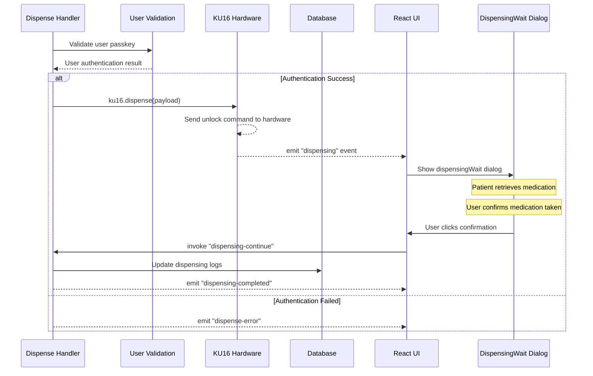

#### Phase 3: Post-Dispense Decision Flow

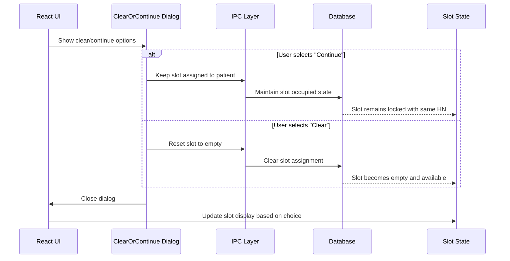

**Business Decision Logic**:
```typescript
// clearOrContinue.tsx - Post-dispense workflow
const ClearOrContinue = ({ slotId, hn, onClose }) => {
  const handleContinue = () => {
    // Multi-dose medication - keep slot assigned
    // Slot remains occupied for next dose
    onClose();
  };
  
  const handleClear = () => {
    // Single dose complete - reset slot
    ipcRenderer.invoke('reset-slot', { slotId });
    onClose();
  };
};
```

### 4. Real-time Hardware Monitoring Flow

#### Temperature & Humidity Data Flow

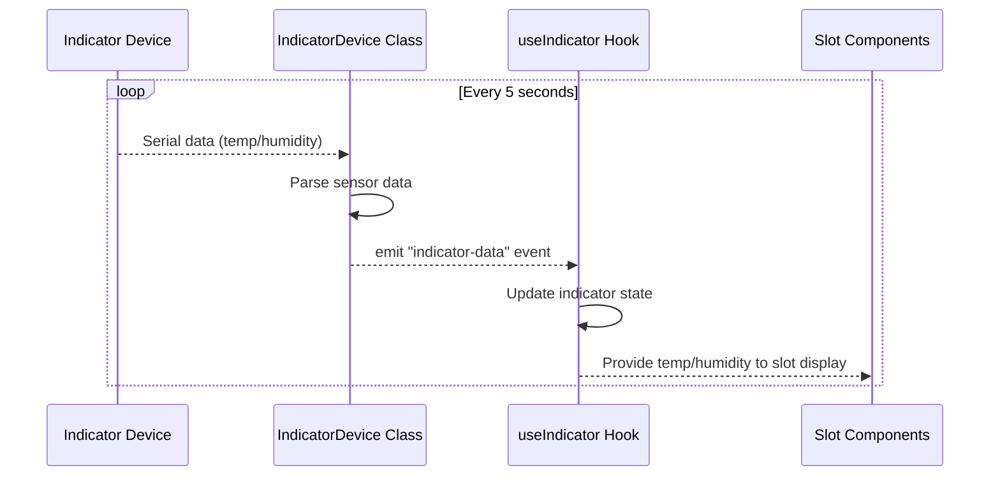

**Real-time Data Integration**:
```typescript
// useIndicator.ts - Real-time sensor data hook
export const useIndicator = () => {
  const [indicator, setIndicator] = useState({
    Temp1: 0, Temp2: 0,
    Huminity1: 0, Huminity2: 0,
    Battery: 0
  });

  useEffect(() => {
    ipcRenderer.on('indicator-data', (event, data) => {
      setIndicator(data);
    });
  }, []);

  return { indicator };
};
```

#### Hardware Status Synchronization

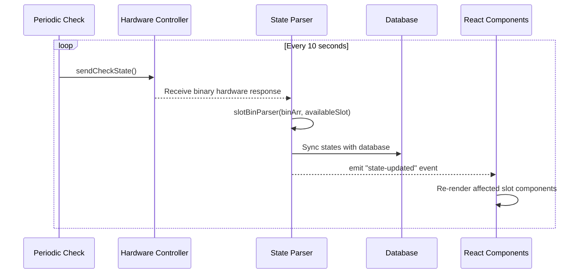

### 5. Admin Dashboard Data Flow

#### User Management Operations

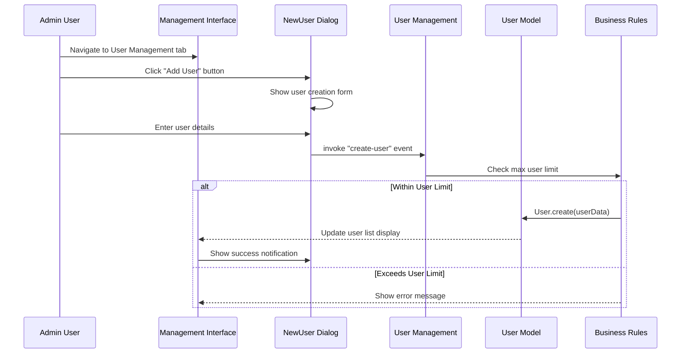

**Business Rule Enforcement**:
```typescript
// User creation with limit validation
const maxUsers = await getSetting('max_log_counts');
const currentUserCount = await User.count();

if (currentUserCount >= maxUsers) {
  throw new Error(`ไม่สามารถเพิ่มผู้ใช้ได้ เกินจำนวนที่กำหนด (${maxUsers})`);
}
```

#### Audit Log Export Flow

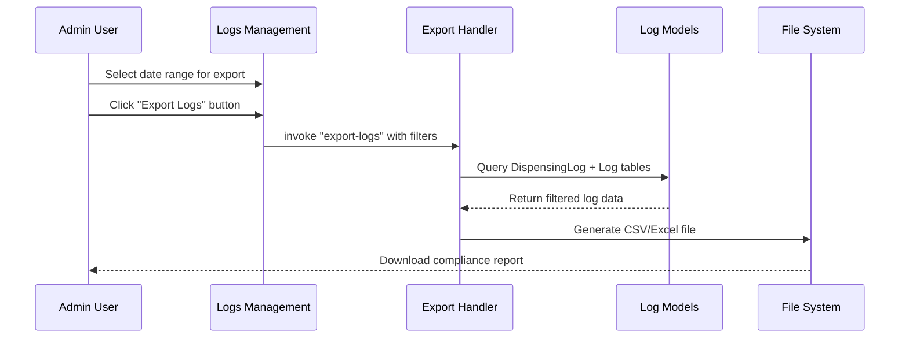

## State Consistency Patterns

### 1. Atomic Operation Pattern

```typescript
// Ensure all-or-nothing operations across layers
export const atomicSlotUpdate = async (slotId: number, operation: string, data: any) => {
  const transaction = await sequelize.transaction();
  
  try {
    // 1. Update database within transaction
    await Slot.update(data, { where: { slotId }, transaction });
    
    // 2. Log operation within same transaction
    await LogDispensing.create({
      slotId, operation, ...data
    }, { transaction });
    
    // 3. Commit database changes
    await transaction.commit();
    
    // 4. Update runtime state
    ku16.updateSlotState(slotId, data);
    
    // 5. Notify UI
    mainWindow.webContents.send('slot-updated', { slotId, data });
    
  } catch (error) {
    await transaction.rollback();
    throw error;
  }
};
```

### 2. Event-Driven Consistency Pattern

```typescript
// Centralized state change events
export class StateManager {
  private emitStateChange(layer: 'database' | 'runtime' | 'ui', change: any) {
    this.eventEmitter.emit('state-change', { layer, change });
  }
  
  // All layers listen for state changes
  private syncAllLayers(change: any) {
    switch (change.type) {
      case 'slot-unlock':
        this.syncDatabase(change);
        this.syncRuntime(change);
        this.syncUI(change);
        break;
    }
  }
}
```

### 3. Optimistic Update Pattern

```typescript
// Update UI immediately, rollback on failure
export const optimisticUnlock = async (slotId: number, data: any) => {
  // 1. Immediate UI update
  setSlots(prev => prev.map(slot => 
    slot.slotId === slotId ? { ...slot, opening: true } : slot
  ));
  
  try {
    // 2. Perform actual operation
    await ipcRenderer.invoke('unlock', data);
  } catch (error) {
    // 3. Rollback UI on failure
    setSlots(prev => prev.map(slot => 
      slot.slotId === slotId ? { ...slot, opening: false } : slot
    ));
    throw error;
  }
};
```

## Error Propagation Patterns

### 1. Hierarchical Error Handling

```
Hardware Error → Business Logic Error → IPC Error Response → UI Error Display
```

**Example Implementation**:
```typescript
// Hardware layer
class KU16 {
  async sendUnlock(data) {
    try {
      const response = await this.serialPort.write(command);
      if (!response.success) {
        throw new HardwareError('Unlock command failed');
      }
    } catch (error) {
      throw new HardwareError(`Hardware communication failed: ${error.message}`);
    }
  }
}

// Business logic layer  
export const unlockHandler = async (payload) => {
  try {
    await ku16.sendUnlock(payload);
  } catch (error) {
    if (error instanceof HardwareError) {
      throw new BusinessLogicError('Hardware unlock failed', error);
    }
  }
};

// IPC layer
ipcMain.handle('unlock', async (event, payload) => {
  try {
    await unlockHandler(payload);
    return { success: true };
  } catch (error) {
    return { success: false, error: error.message };
  }
});

// UI layer
const unlock = async (data) => {
  const result = await ipcRenderer.invoke('unlock', data);
  if (!result.success) {
    toast.error(result.error);
  }
};
```

### 2. Medical Device Audit Pattern

```typescript
// All operations logged regardless of success/failure
export const auditableOperation = async (operation: string, data: any, handler: Function) => {
  const startTime = Date.now();
  let result = null;
  let error = null;
  
  try {
    result = await handler(data);
    
    // Log successful operation
    await logDispensing({
      userId: data.userId,
      slotId: data.slotId,
      hn: data.hn,
      process: operation,
      message: `${operation} completed successfully`,
      duration: Date.now() - startTime
    });
    
    return result;
  } catch (err) {
    error = err;
    
    // Log failed operation with error details
    await logDispensing({
      userId: data.userId || 'system',
      slotId: data.slotId,
      hn: data.hn,
      process: `${operation}-error`,
      message: `${operation} failed: ${err.message}`,
      duration: Date.now() - startTime
    });
    
    throw err;
  }
};
```

## Migration Impact on Data Flow

### Current State (Legacy KU16)
```
UI → IPC → KU16 Class → Serial Port → Hardware
```

### Target State (Abstract Controllers)
```
UI → IPC → ControllerFactory → DS12/DS16Controller → ProtocolParser → Serial Port → Hardware
```

### Migration Strategy for Data Flow Preservation

1. **Phase 1**: Maintain existing IPC interfaces
2. **Phase 2**: Add controller factory behind existing interfaces
3. **Phase 3**: Gradually migrate IPC handlers to new controllers
4. **Phase 4**: Remove legacy KU16 implementation

**Backward Compatibility Pattern**:
```typescript
// Maintain existing IPC interface during migration
ipcMain.handle('unlock', async (event, payload) => {
  // Route to appropriate controller based on device type
  const controller = ControllerFactory.getController();
  return await controller.unlock(payload);
});
```

This comprehensive data flow documentation provides the foundation for understanding state management patterns and ensuring safe refactoring while preserving medical device functionality and audit compliance.