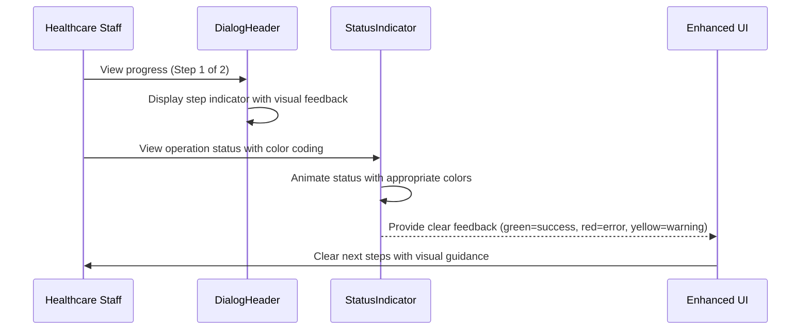
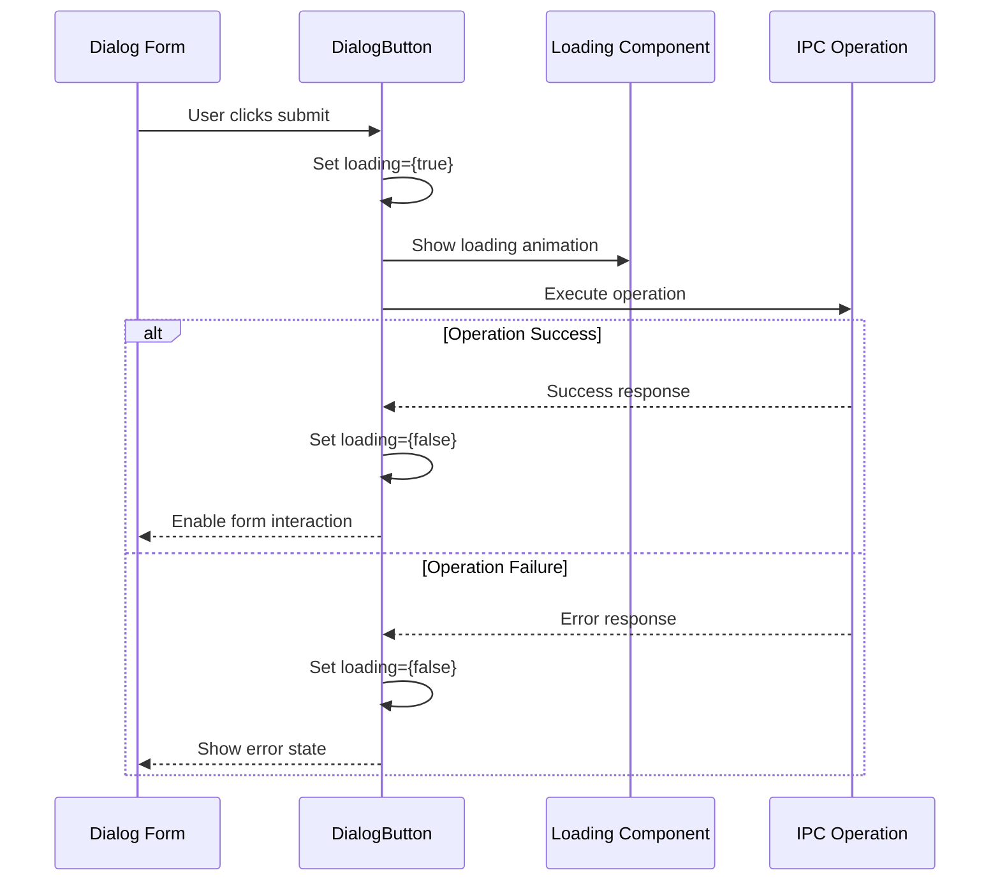

# Data Flow Patterns & State Management

## Overview

This document maps the complete data flow patterns within the Smart Medication Cart system, from user interactions to hardware operations. Understanding these patterns is critical for safe refactoring without compromising medical device state integrity or audit compliance.

## State Management Architecture

### Three-Layer State Synchronization

```
┌─────────────────────────────────────────────────────────────────┐
│                        UI LAYER (React)                        │
│ • Component State (useState, useForm)                          │
│ • Context State (Authentication, Dispensing)                   │ 
│ • Hook State (useKuStates, useUnlock, useDispense)            │
│ • Modal State (Dialog visibility, form data)                   │
└─────────────────────────────────────────────────────────────────┘
                        ▲ IPC Events ▼ IPC Calls
┌─────────────────────────────────────────────────────────────────┐
│                  BUSINESS LOGIC LAYER (Main)                   │
│ • Runtime State (BuildTimeController properties)               │
│ • Session State (Authentication, device connections)           │
│ • Operation State (opening, dispensing, waitFor flags)         │
│ • Cache State (slot states, user sessions)                     │
└─────────────────────────────────────────────────────────────────┘
                        ▲ ORM Operations ▼ Database Queries
┌─────────────────────────────────────────────────────────────────┐
│                   DATABASE LAYER (SQLite)                      │
│ • Persistent State (Slot, User, Setting models)                │
│ • Audit Logs (DispensingLog, SystemLog)                       │
│ • Configuration State (Device settings, user preferences)      │
│ • Historical Data (Operation history, error logs)              │
└─────────────────────────────────────────────────────────────────┘
```

### State Synchronization Challenges

**1. State Redundancy Issues**:
- Same slot state exists in: Database → BuildTimeController → React hooks → Component state
- Risk of inconsistency during concurrent operations
- Need for atomic state updates across layers

**2. Race Condition Scenarios**:
- Hardware response arrives while UI is updating
- User actions trigger multiple overlapping hardware operations
- Database updates concurrent with IPC events

**3. Error Recovery Complexity**:
- Partial failures require rollback across all layers
- Hardware timeout during state transitions
- Database connection loss during critical operations

## Core Data Flow Patterns

### 1. System Initialization Flow

```mermaid
sequenceDiagram
    participant UI as React UI
    participant IPC as IPC Layer
    participant Main as Main Process
    participant DB as Database
    participant HW as Hardware

    UI->>IPC: Component mount → useKuStates.get()
    IPC->>Main: ipcRenderer.invoke("init")
    Main->>DB: Load settings & slot states
    Main->>HW: Initialize BuildTimeController connection
    HW-->>Main: Hardware connection status
    Main->>DB: Sync hardware states with database
    Main-->>IPC: emit "init-res" with slot array
    IPC-->>UI: Update slots state via hook
    UI-->>UI: Render 15-slot grid
```



**Critical Files**:
- **Entry**: `/renderer/hooks/useKuStates.ts` → `get()` function
- **Handler**: `/main/ku16/ipcMain/init.ts`
- **Hardware**: BuildTimeController → `sendCheckState()`
- **Database**: Sequelize models via `/db/sequelize.ts`

**State Dependencies**:
```typescript
// Database State → Runtime State → UI State
const databaseSlots = await Slot.findAll();          // Database layer
controller.updateInternalState(databaseSlots);       // Business logic layer
mainWindow.webContents.send('init-res', slotArray); // UI layer
```

### 2. Medication Loading (Unlock) Flow

#### Phase 1: User Input & Validation

```mermaid
sequenceDiagram
    participant User as Healthcare Staff
    participant Modal as InputSlot Dialog
    participant Hook as useUnlock Hook
    participant Validation as Client Validation
    participant IPC as IPC Layer

    User->>Modal: Click empty slot
    Modal->>Modal: Open input dialog
    User->>Modal: Enter HN + passkey
    Modal->>Validation: checkDuplicate(hn)
    Validation->>Hook: Valid data → unlock(slotId, hn, passkey)
    Hook->>IPC: ipcRenderer.invoke("unlock", payload)
    Modal->>Modal: Close dialog
```



**Enhanced Form Validation with React Hook Form**:
```typescript
// React Hook Form integration in inputSlot.tsx
const { register, handleSubmit, formState: { errors } } = useForm<Inputs>();

// Form submission with enhanced validation
const onSubmit: SubmitHandler<Inputs> = (data) => {
  console.log("🔍 InputSlot Form Submit - Data:", data);
  console.log("🔍 InputSlot Form Submit - SlotNo:", slotNo);

  // Passkey validation
  if (data.passkey == "") {
    toast.error("กรุณากรอกรหัสผู้ใช้");
    return;
  }

  // Business logic validation
  if (!checkDuplicate(data.hn)) {
    toast.error("ไม่สามารถลงทะเบียนซ้ำได้");
    return;
  } else {
    console.log("✅ InputSlot calling unlock function");
    unlock(slotNo, data.hn, data.passkey);
    onClose();
  }
};

// Enhanced duplicate checking
const checkDuplicate = (hn: string) => {
  const found = slots.find((slot) => slot.hn == hn);
  return found == undefined && slots.length > 0 ? true : false;
};

// Form rendering with validation feedback
<form className="flex flex-col gap-4" onSubmit={handleSubmit(onSubmit)}>
  <DialogInput
    placeholder="รหัสผู้ป่วย"
    error={errors.hn ? "กรุณากรอกรหัสผู้ป่วย" : undefined}
    {...register("hn", { required: true })}
  />
  <DialogInput
    type="password"
    placeholder="รหัสผู้ใช้"
    error={errors.passkey ? "กรุณากรอกรหัสผู้ใช้" : undefined}
    {...register("passkey", { required: true })}
  />
  <DialogButton type="submit" variant="primary" icon="✓">ตกลง</DialogButton>
</form>
```

#### Phase 2: Server-side Processing & Hardware Control

```mermaid
sequenceDiagram
    participant IPC as IPC Handler
    participant Auth as Authentication
    participant Log as Logging System
    participant HW as Hardware Device
    participant DB as Database
    participant UI as React UI

    IPC->>Auth: User.findOne({ passkey })
    Auth-->>IPC: User validation result
    
    alt User Found
        IPC->>Log: Log unlock attempt
        IPC->>HW: controller.sendUnlock(payload)
        HW-->>HW: Send hardware unlock command
        IPC->>DB: Log successful unlock
        IPC->>HW: controller.sendCheckState() (after 1s delay)
        HW-->>UI: Hardware state change → "unlocking" event
    else User Not Found
        IPC->>Log: Log failed attempt
        IPC-->>UI: emit "unlock-error" event
    end
```



**Critical Error Handling**:
```typescript
// Server-side validation in unlock.ts
try {
  const user = await User.findOne({ where: { passkey: payload.passkey } });
  if (!user) {
    throw new Error("ไม่พบผู้ใช้งาน");
  }
  
  await controller.sendUnlock(payload);
  await logDispensing({
    userId: userId,
    hn: payload.hn,
    slotId: payload.slotId,
    process: "unlock",
    message: "ปลดล็อคสำเร็จ"
  });
} catch (error) {
  // Error logging and UI notification
  controller.win.webContents.send("unlock-error", {
    message: "ปลดล็อกไม่สำเร็จกรุณาตรวจสอบรหัสผู้ใช้งานอีกครั้ง"
  });
}
```

#### Phase 3: Hardware Response & UI Synchronization

```mermaid
sequenceDiagram
    participant HW as Hardware Device
    participant CTRL as BuildTimeController
    participant DB as Database
    participant UI as React UI
    participant Modal as LockWait Dialog

    HW-->>CTRL: Serial response (unlock confirmation)
    CTRL->>CTRL: receivedUnlockState(data)
    CTRL->>DB: Update slot state (opening: true)
    CTRL-->>UI: emit "unlocking" event
    UI->>Modal: Show lockWait dialog
    
    Note over Modal: User manually loads medication
    Note over Modal: User closes slot door
    
    Modal->>UI: User clicks "ปิดช่องเรียบร้อย"
    UI->>IPC: invoke "check-locked-back"
    IPC->>CTRL: Verify slot is locked
    CTRL->>DB: Update slot state (occupied: true, opening: false)
    CTRL-->>UI: emit state update
    UI->>Modal: Close dialog, update slot display
```



### 2.5 Enhanced User Experience Patterns (Latest Update)

#### Multi-Step Progress Indication


**Enhanced Dialog Header with Progress**:
```typescript
// DialogHeader with step progression
<DialogHeader
  title=""
  currentStep={1}
  totalSteps={2}
  hn={hn}
  onEmergencyAction={onOpenDeactive}
  emergencyLabel="!"
  bgColor="bg-blue-50"      // Step-specific background color
  textColor="text-blue-700" // Step-specific text color
/>
```

**Status Indicator Integration**:
```typescript
// Enhanced status feedback in dispensingWait.tsx
<StatusIndicator
  status="error"        // Color-coded status (red for slot open)
  message="เปิดอยู่"      // Thai language status message
  slotNo={slotNo}       // Automatic slot number formatting
  animated={true}       // Pulsing animation for active states
/>
```

#### Loading State Management


**Enhanced Loading Integration**:
```typescript
// auth.tsx - Loading state management
const [loading, setLoading] = useState(false);

const onSubmit: SubmitHandler<Inputs> = async (data) => {
  console.log("🔍 Auth Form Submit - Data:", data);
  setLoading(true);

  if (data.passkey == "" || data.passkey == null) {
    console.log("❌ Auth - Empty passkey");
    setLoading(false);
    toast.error(`กรุณาใส่ข้อมูลให้ครบถ้วน`, { toastId: 99, type: "error" });
    return;
  }

  const req: AuthRequest = { passkey: data.passkey };
  console.log("✅ Auth calling IPC login-req");
  ipcRenderer.invoke("login-req", req);
};

// Enhanced button with loading state
<DialogButton
  type="submit"
  variant="primary"
  loading={loading}        // Integrated loading state
  disabled={loading}       // Prevent double submission
  icon="🔐"
>
  เข้าสู่ระบบ
</DialogButton>
```

#### Error Handling Enhancement
```typescript
// Enhanced error propagation with visual feedback
const handleCheckLockedBack = () => {
  // Validate required data before IPC call
  if (!slotNo || !hn) {
    console.error("DISPENSING WAIT ERROR: Missing slotNo or hn", { slotNo, hn });
    toast.error("ข้อมูลไม่ครบถ้วน กรุณาเริ่มกระบวนการใหม่");
    return;
  }

  console.log("DISPENSING DIALOG TRACE: CHECK LOCKED BACK ON DISPENSING PROCESS", {
    slotId: slotNo,
    hn: hn,
  });

  setIsCheckingLock(true);

  ipcRenderer
    .invoke("check-locked-back", { slotId: slotNo, hn: hn })
    .then(() => {
      console.log("DISPENSING WAIT DEBUG: check-locked-back IPC call successful");
      setIsCheckingLock(false);
    })
    .catch((error) => {
      console.error("DISPENSING WAIT ERROR: check-locked-back IPC failed:", error);
      toast.error("ไม่สามารถตรวจสอบการปิดช่องได้: " + error.message);
      setIsCheckingLock(false);
    });
};
```

### 3. Medication Dispensing Flow

#### Phase 1: Patient Verification

```mermaid
sequenceDiagram
    participant User as Healthcare Staff
    participant Slot as Locked Slot Component
    participant Modal as DispenseSlot Dialog
    participant Hook as useDispense Hook

    User->>Slot: Click "จ่ายยา" button
    Slot->>Modal: Open dispense dialog
    Modal->>Modal: Show pre-filled patient HN
    User->>Modal: Verify HN + enter passkey
    Modal->>Hook: dispense(slotId, hn, passkey)
    Hook->>IPC: invoke "dispense" event
    Modal->>Modal: Close dialog
```



**Pre-filled Data Pattern**:
```typescript
// dispenseSlot.tsx - Patient HN pre-filled for verification
const DispenseSlot = ({ slotNo, hn, onClose }) => {
  const { dispense } = useDispense();
  
  const onSubmit = (data) => {
    // HN is read-only, user must verify it matches patient
    dispense(slotNo, hn, data.passkey);
    onClose();
  };
};
```

#### Phase 2: Hardware Dispense Operation


#### Phase 3: Post-Dispense Decision Flow


**Business Decision Logic**:
```typescript
// clearOrContinue.tsx - Post-dispense workflow
const ClearOrContinue = ({ slotId, hn, onClose }) => {
  const handleContinue = () => {
    // Multi-dose medication - keep slot assigned
    // Slot remains occupied for next dose
    onClose();
  };
  
  const handleClear = () => {
    // Single dose complete - reset slot
    ipcRenderer.invoke('reset-slot', { slotId });
    onClose();
  };
};
```

### 4. Real-time Hardware Monitoring Flow

#### Temperature & Humidity Data Flow


**Real-time Data Integration**:
```typescript
// useIndicator.ts - Real-time sensor data hook
export const useIndicator = () => {
  const [indicator, setIndicator] = useState({
    Temp1: 0, Temp2: 0,
    Huminity1: 0, Huminity2: 0,
    Battery: 0
  });

  useEffect(() => {
    ipcRenderer.on('indicator-data', (event, data) => {
      setIndicator(data);
    });
  }, []);

  return { indicator };
};
```

#### Hardware Status Synchronization


### 5. Admin Dashboard Data Flow

#### User Management Operations


**Business Rule Enforcement**:
```typescript
// User creation with limit validation
const maxUsers = await getSetting('max_log_counts');
const currentUserCount = await User.count();

if (currentUserCount >= maxUsers) {
  throw new Error(`ไม่สามารถเพิ่มผู้ใช้ได้ เกินจำนวนที่กำหนด (${maxUsers})`);
}
```

#### Audit Log Export Flow


## State Consistency Patterns

### 1. Atomic Operation Pattern

```typescript
// Ensure all-or-nothing operations across layers
export const atomicSlotUpdate = async (slotId: number, operation: string, data: any) => {
  const transaction = await sequelize.transaction();
  
  try {
    // 1. Update database within transaction
    await Slot.update(data, { where: { slotId }, transaction });
    
    // 2. Log operation within same transaction
    await LogDispensing.create({
      slotId, operation, ...data
    }, { transaction });
    
    // 3. Commit database changes
    await transaction.commit();
    
    // 4. Update runtime state
    controller.updateSlotState(slotId, data);
    
    // 5. Notify UI
    mainWindow.webContents.send('slot-updated', { slotId, data });
    
  } catch (error) {
    await transaction.rollback();
    throw error;
  }
};
```

### 2. Event-Driven Consistency Pattern

```typescript
// Centralized state change events
export class StateManager {
  private emitStateChange(layer: 'database' | 'runtime' | 'ui', change: any) {
    this.eventEmitter.emit('state-change', { layer, change });
  }
  
  // All layers listen for state changes
  private syncAllLayers(change: any) {
    switch (change.type) {
      case 'slot-unlock':
        this.syncDatabase(change);
        this.syncRuntime(change);
        this.syncUI(change);
        break;
    }
  }
}
```

### 3. Optimistic Update Pattern

```typescript
// Update UI immediately, rollback on failure
export const optimisticUnlock = async (slotId: number, data: any) => {
  // 1. Immediate UI update
  setSlots(prev => prev.map(slot => 
    slot.slotId === slotId ? { ...slot, opening: true } : slot
  ));
  
  try {
    // 2. Perform actual operation
    await ipcRenderer.invoke('unlock', data);
  } catch (error) {
    // 3. Rollback UI on failure
    setSlots(prev => prev.map(slot => 
      slot.slotId === slotId ? { ...slot, opening: false } : slot
    ));
    throw error;
  }
};
```

## Error Propagation Patterns

### 1. Hierarchical Error Handling

```
Hardware Error → Business Logic Error → IPC Error Response → UI Error Display
```

**Example Implementation**:
```typescript
// Hardware layer
class BuildTimeController {
  async sendUnlock(data) {
    try {
      const response = await this.serialPort.write(command);
      if (!response.success) {
        throw new HardwareError('Unlock command failed');
      }
    } catch (error) {
      throw new HardwareError(`Hardware communication failed: ${error.message}`);
    }
  }
}

// Business logic layer  
export const unlockHandler = async (payload) => {
  try {
    await controller.sendUnlock(payload);
  } catch (error) {
    if (error instanceof HardwareError) {
      throw new BusinessLogicError('Hardware unlock failed', error);
    }
  }
};

// IPC layer
ipcMain.handle('unlock', async (event, payload) => {
  try {
    await unlockHandler(payload);
    return { success: true };
  } catch (error) {
    return { success: false, error: error.message };
  }
});

// UI layer
const unlock = async (data) => {
  const result = await ipcRenderer.invoke('unlock', data);
  if (!result.success) {
    toast.error(result.error);
  }
};
```

### 2. Medical Device Audit Pattern

```typescript
// All operations logged regardless of success/failure
export const auditableOperation = async (operation: string, data: any, handler: Function) => {
  const startTime = Date.now();
  let result = null;
  let error = null;
  
  try {
    result = await handler(data);
    
    // Log successful operation
    await logDispensing({
      userId: data.userId,
      slotId: data.slotId,
      hn: data.hn,
      process: operation,
      message: `${operation} completed successfully`,
      duration: Date.now() - startTime
    });
    
    return result;
  } catch (err) {
    error = err;
    
    // Log failed operation with error details
    await logDispensing({
      userId: data.userId || 'system',
      slotId: data.slotId,
      hn: data.hn,
      process: `${operation}-error`,
      message: `${operation} failed: ${err.message}`,
      duration: Date.now() - startTime
    });
    
    throw err;
  }
};
```

## Migration Impact on Data Flow

### Current State (Production BuildTimeController)
```
UI → IPC → BuildTimeController → Protocol Parser → Serial Port → Hardware
```

### Target State (Abstract Controllers)
```
UI → IPC → ControllerFactory → DS12/DS16Controller → ProtocolParser → Serial Port → Hardware
```

### Migration Strategy for Data Flow Preservation

1. **Phase 1**: Maintain existing IPC interfaces
2. **Phase 2**: Add controller factory behind existing interfaces
3. **Phase 3**: Gradually migrate IPC handlers to new controllers
4. **Phase 4**: BuildTimeController production deployment (COMPLETED)

**Backward Compatibility Pattern**:
```typescript
// Maintain existing IPC interface during migration
ipcMain.handle('unlock', async (event, payload) => {
  // Route to appropriate controller based on device type
  const controller = ControllerFactory.getController();
  return await controller.unlock(payload);
});
```

This comprehensive data flow documentation provides the foundation for understanding state management patterns and ensuring safe refactoring while preserving medical device functionality and audit compliance.